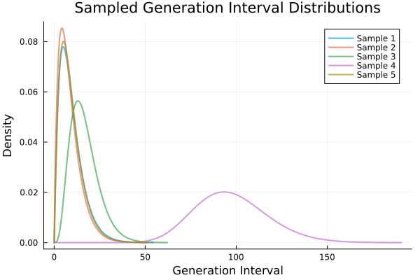

````julia
using CensoredDistributions
using Distributions, LinearAlgebra, Markdown
using JET: @report_opt
using Random: seed!
using StatsPlots
using Turing
using ReverseDiff, Mooncake
using RenewalExamples: UnknownGI
using Enzyme: set_runtime_activity, Reverse, Forward

seed!(1234)
````

````
Random.TaskLocalRNG()
````

# Renewal Process Examples

This notebook demonstrates how to simulate renewal models in various ways.

## Defining an unknown generation interval distribution

We can define an unknown generation interval (GI) distribution using the `UnknownGI` struct.
`UnknownGI` allows us to specify a distribution type along with prior distributions for its parameters, as well as censoring parameters in anticipation of double interval censoring.

````julia
ugi = UnknownGI(
    dist_type = Gamma,
    param_priors = (a = LogNormal(log(3.0), 1.0), b = truncated(Normal(4.0, 0.5), 0, Inf)),
    interval = 1.0,
    upper = 40.0
);
````

A sample from `ugi` generates a random generation interval distribution based on the specified priors.

````julia
p = plot(;
    xlabel = "Generation Interval", ylabel = "Density",
    title = "Sampled Generation Interval Distributions"
)

for i in 1:5
    gi_dist = rand(ugi)
    plot!(p, gi_dist, label = "Sample $i", lw = 2, alpha = 0.7)
end
p
````


The sampling is type-stable, see [Modern Julia Workflows](https://modernjuliaworkflows.org/optimizing/#type_stability) for more information.

````julia
@report_opt rand(ugi)
````

````
No errors detected

````

Any particular parameter values can be used to create a double interval censored distribution using the `double_interval_censored` method for `UnknownGI`.

````julia
true_shape_param = 3.0
true_scale_param = 4.0
censored_gi = double_interval_censored(ugi, true_shape_param, true_scale_param) # shape=3.0, scale=4.0
````

````
CensoredDistributions.IntervalCensored{Distributions.Truncated{CensoredDistributions.PrimaryCensored{Distributions.Gamma{Float64}, Distributions.Uniform{Float64}, CensoredDistributions.AnalyticalSolver{Integrals.QuadGKJL{typeof(LinearAlgebra.norm), Nothing}}}, Distributions.Continuous, Float64, Nothing, Float64}, Float64}(
dist: Truncated(CensoredDistributions.PrimaryCensored{Distributions.Gamma{Float64}, Distributions.Uniform{Float64}, CensoredDistributions.AnalyticalSolver{Integrals.QuadGKJL{typeof(LinearAlgebra.norm), Nothing}}}(
dist: Distributions.Gamma{Float64}(α=3.0, θ=4.0)
primary_event: Distributions.Uniform{Float64}(a=0.0, b=1.0)
method: CensoredDistributions.AnalyticalSolver{Integrals.QuadGKJL{typeof(LinearAlgebra.norm), Nothing}}(Integrals.QuadGKJL{typeof(LinearAlgebra.norm), Nothing}(7, LinearAlgebra.norm, nothing))
)
; upper=40.0)

boundaries: 1.0
)

````

### Inference on the generation interval distribution

Often at the start of an outbreak, the generation interval distribution is not known and we have a joint estimation problem:

- Estimate the parameters of the generation interval distribution.
- Estimate the time-varying reproduction number.

We'll start by looking at a simpler example where we have observed some (censored) generation intervals from early traced infector-infectee pairs.
We set up a `Turing.jl` model to estimate the parameters of the generation interval distribution given these observed (censored) intervals.

````julia
simulated_data_seqn = rand(censored_gi, 100)
vals = unique(simulated_data_seqn)
simulated_data_binned = [count(==(val), simulated_data_seqn) for val in vals]

@model function fit_gi(
        vals, binned_data, ugi::UnknownGI{DT, P, T}
    ) where {DT, P <: NamedTuple, T <: Real}

    params ~ arraydist(collect(values(ugi.param_priors))) # Sample parameters from priors
    censored_gi = double_interval_censored(ugi, params...) # Create censored GI distribution

    vals ~ weight(censored_gi, binned_data)     # Vectorized weighted likelihood c.f `CensoredDistributions.jl`
    return
end
````

````
fit_gi (generic function with 2 methods)
````

Now we can fit the generation interval distribution to the simulated (censored) data.

````julia
fit_mdl = fit_gi(vals, simulated_data_binned, ugi);
chain = sample(fit_mdl, NUTS(), 1000);
describe(chain)
````

````
Sampling   0%|                                          |  ETA: N/A
┌ Info: Found initial step size
└   ϵ = 0.05
Sampling   1%|▎                                         |  ETA: 0:09:19
Sampling   1%|▍                                         |  ETA: 0:04:58
Sampling   2%|▋                                         |  ETA: 0:03:13
Sampling   2%|▉                                         |  ETA: 0:02:28
Sampling   3%|█▏                                        |  ETA: 0:01:56
Sampling   3%|█▎                                        |  ETA: 0:01:38
Sampling   4%|█▌                                        |  ETA: 0:01:22
Sampling   4%|█▋                                        |  ETA: 0:01:13
Sampling   5%|█▉                                        |  ETA: 0:01:04
Sampling   5%|██▏                                       |  ETA: 0:00:58
Sampling   6%|██▍                                       |  ETA: 0:00:52
Sampling   6%|██▌                                       |  ETA: 0:00:48
Sampling   7%|██▊                                       |  ETA: 0:00:43
Sampling   7%|███                                       |  ETA: 0:00:40
Sampling   8%|███▏                                      |  ETA: 0:00:37
Sampling   8%|███▍                                      |  ETA: 0:00:35
Sampling   9%|███▋                                      |  ETA: 0:00:33
Sampling   9%|███▊                                      |  ETA: 0:00:31
Sampling  10%|████                                      |  ETA: 0:00:29
Sampling  10%|████▎                                     |  ETA: 0:00:28
Sampling  11%|████▍                                     |  ETA: 0:00:26
Sampling  11%|████▋                                     |  ETA: 0:00:25
Sampling  12%|████▉                                     |  ETA: 0:00:24
Sampling  12%|█████                                     |  ETA: 0:00:22
Sampling  13%|█████▎                                    |  ETA: 0:00:21
Sampling  13%|█████▌                                    |  ETA: 0:00:21
Sampling  14%|█████▋                                    |  ETA: 0:00:20
Sampling  14%|█████▉                                    |  ETA: 0:00:19
Sampling  15%|██████▏                                   |  ETA: 0:00:18
Sampling  15%|██████▎                                   |  ETA: 0:00:17
Sampling  16%|██████▌                                   |  ETA: 0:00:17
Sampling  16%|██████▊                                   |  ETA: 0:00:16
Sampling  17%|███████                                   |  ETA: 0:00:16
Sampling  17%|███████▏                                  |  ETA: 0:00:15
Sampling  18%|███████▍                                  |  ETA: 0:00:15
Sampling  18%|███████▌                                  |  ETA: 0:00:14
Sampling  19%|███████▊                                  |  ETA: 0:00:14
Sampling  19%|████████                                  |  ETA: 0:00:13
Sampling  20%|████████▎                                 |  ETA: 0:00:13
Sampling  20%|████████▍                                 |  ETA: 0:00:12
Sampling  21%|████████▋                                 |  ETA: 0:00:12
Sampling  21%|████████▉                                 |  ETA: 0:00:12
Sampling  22%|█████████                                 |  ETA: 0:00:11
Sampling  22%|█████████▎                                |  ETA: 0:00:11
Sampling  23%|█████████▌                                |  ETA: 0:00:11
Sampling  23%|█████████▋                                |  ETA: 0:00:10
Sampling  24%|█████████▉                                |  ETA: 0:00:10
Sampling  24%|██████████▏                               |  ETA: 0:00:10
Sampling  25%|██████████▎                               |  ETA: 0:00:10
Sampling  25%|██████████▌                               |  ETA: 0:00:09
Sampling  26%|██████████▊                               |  ETA: 0:00:09
Sampling  26%|██████████▉                               |  ETA: 0:00:09
Sampling  27%|███████████▏                              |  ETA: 0:00:09
Sampling  27%|███████████▍                              |  ETA: 0:00:08
Sampling  28%|███████████▋                              |  ETA: 0:00:08
Sampling  28%|███████████▊                              |  ETA: 0:00:08
Sampling  29%|████████████                              |  ETA: 0:00:08
Sampling  29%|████████████▏                             |  ETA: 0:00:08
Sampling  30%|████████████▍                             |  ETA: 0:00:08
Sampling  30%|████████████▋                             |  ETA: 0:00:07
Sampling  31%|████████████▉                             |  ETA: 0:00:07
Sampling  31%|█████████████                             |  ETA: 0:00:07
Sampling  32%|█████████████▎                            |  ETA: 0:00:07
Sampling  32%|█████████████▌                            |  ETA: 0:00:07
Sampling  33%|█████████████▋                            |  ETA: 0:00:07
Sampling  33%|█████████████▉                            |  ETA: 0:00:06
Sampling  34%|██████████████▏                           |  ETA: 0:00:07
Sampling  34%|██████████████▎                           |  ETA: 0:00:07
Sampling  35%|██████████████▌                           |  ETA: 0:00:06
Sampling  35%|██████████████▊                           |  ETA: 0:00:06
Sampling  36%|██████████████▉                           |  ETA: 0:00:06
Sampling  36%|███████████████▏                          |  ETA: 0:00:06
Sampling  37%|███████████████▍                          |  ETA: 0:00:06
Sampling  37%|███████████████▌                          |  ETA: 0:00:06
Sampling  38%|███████████████▊                          |  ETA: 0:00:06
Sampling  38%|████████████████                          |  ETA: 0:00:06
Sampling  39%|████████████████▏                         |  ETA: 0:00:05
Sampling  39%|████████████████▍                         |  ETA: 0:00:05
Sampling  40%|████████████████▋                         |  ETA: 0:00:05
Sampling  40%|████████████████▊                         |  ETA: 0:00:05
Sampling  41%|█████████████████                         |  ETA: 0:00:05
Sampling  41%|█████████████████▎                        |  ETA: 0:00:05
Sampling  42%|█████████████████▌                        |  ETA: 0:00:05
Sampling  42%|█████████████████▋                        |  ETA: 0:00:05
Sampling  43%|█████████████████▉                        |  ETA: 0:00:05
Sampling  43%|██████████████████                        |  ETA: 0:00:05
Sampling  44%|██████████████████▎                       |  ETA: 0:00:04
Sampling  44%|██████████████████▌                       |  ETA: 0:00:04
Sampling  45%|██████████████████▊                       |  ETA: 0:00:04
Sampling  45%|██████████████████▉                       |  ETA: 0:00:04
Sampling  46%|███████████████████▏                      |  ETA: 0:00:04
Sampling  46%|███████████████████▍                      |  ETA: 0:00:04
Sampling  47%|███████████████████▌                      |  ETA: 0:00:04
Sampling  47%|███████████████████▊                      |  ETA: 0:00:04
Sampling  48%|████████████████████                      |  ETA: 0:00:04
Sampling  48%|████████████████████▏                     |  ETA: 0:00:04
Sampling  49%|████████████████████▍                     |  ETA: 0:00:04
Sampling  49%|████████████████████▋                     |  ETA: 0:00:04
Sampling  50%|████████████████████▊                     |  ETA: 0:00:04
Sampling  50%|█████████████████████                     |  ETA: 0:00:03
Sampling  51%|█████████████████████▎                    |  ETA: 0:00:03
Sampling  51%|█████████████████████▍                    |  ETA: 0:00:03
Sampling  52%|█████████████████████▋                    |  ETA: 0:00:03
Sampling  52%|█████████████████████▉                    |  ETA: 0:00:03
Sampling  53%|██████████████████████▏                   |  ETA: 0:00:03
Sampling  53%|██████████████████████▎                   |  ETA: 0:00:03
Sampling  54%|██████████████████████▌                   |  ETA: 0:00:03
Sampling  54%|██████████████████████▋                   |  ETA: 0:00:03
Sampling  55%|██████████████████████▉                   |  ETA: 0:00:03
Sampling  55%|███████████████████████▏                  |  ETA: 0:00:03
Sampling  56%|███████████████████████▍                  |  ETA: 0:00:03
Sampling  56%|███████████████████████▌                  |  ETA: 0:00:03
Sampling  57%|███████████████████████▊                  |  ETA: 0:00:03
Sampling  57%|████████████████████████                  |  ETA: 0:00:03
Sampling  58%|████████████████████████▏                 |  ETA: 0:00:03
Sampling  58%|████████████████████████▍                 |  ETA: 0:00:03
Sampling  59%|████████████████████████▋                 |  ETA: 0:00:02
Sampling  59%|████████████████████████▊                 |  ETA: 0:00:02
Sampling  60%|█████████████████████████                 |  ETA: 0:00:02
Sampling  60%|█████████████████████████▎                |  ETA: 0:00:02
Sampling  61%|█████████████████████████▍                |  ETA: 0:00:02
Sampling  61%|█████████████████████████▋                |  ETA: 0:00:02
Sampling  62%|█████████████████████████▉                |  ETA: 0:00:02
Sampling  62%|██████████████████████████                |  ETA: 0:00:02
Sampling  63%|██████████████████████████▎               |  ETA: 0:00:02
Sampling  63%|██████████████████████████▌               |  ETA: 0:00:02
Sampling  64%|██████████████████████████▋               |  ETA: 0:00:02
Sampling  64%|██████████████████████████▉               |  ETA: 0:00:02
Sampling  65%|███████████████████████████▏              |  ETA: 0:00:02
Sampling  65%|███████████████████████████▎              |  ETA: 0:00:02
Sampling  66%|███████████████████████████▌              |  ETA: 0:00:02
Sampling  66%|███████████████████████████▊              |  ETA: 0:00:02
Sampling  67%|████████████████████████████              |  ETA: 0:00:02
Sampling  67%|████████████████████████████▏             |  ETA: 0:00:02
Sampling  68%|████████████████████████████▍             |  ETA: 0:00:02
Sampling  68%|████████████████████████████▌             |  ETA: 0:00:02
Sampling  69%|████████████████████████████▊             |  ETA: 0:00:02
Sampling  69%|█████████████████████████████             |  ETA: 0:00:02
Sampling  70%|█████████████████████████████▎            |  ETA: 0:00:02
Sampling  70%|█████████████████████████████▍            |  ETA: 0:00:02
Sampling  71%|█████████████████████████████▋            |  ETA: 0:00:01
Sampling  71%|█████████████████████████████▉            |  ETA: 0:00:01
Sampling  72%|██████████████████████████████            |  ETA: 0:00:01
Sampling  72%|██████████████████████████████▎           |  ETA: 0:00:01
Sampling  73%|██████████████████████████████▌           |  ETA: 0:00:01
Sampling  73%|██████████████████████████████▋           |  ETA: 0:00:01
Sampling  74%|██████████████████████████████▉           |  ETA: 0:00:01
Sampling  74%|███████████████████████████████▏          |  ETA: 0:00:01
Sampling  75%|███████████████████████████████▎          |  ETA: 0:00:01
Sampling  75%|███████████████████████████████▌          |  ETA: 0:00:01
Sampling  76%|███████████████████████████████▊          |  ETA: 0:00:01
Sampling  76%|███████████████████████████████▉          |  ETA: 0:00:01
Sampling  77%|████████████████████████████████▏         |  ETA: 0:00:01
Sampling  77%|████████████████████████████████▍         |  ETA: 0:00:01
Sampling  78%|████████████████████████████████▋         |  ETA: 0:00:01
Sampling  78%|████████████████████████████████▊         |  ETA: 0:00:01
Sampling  79%|█████████████████████████████████         |  ETA: 0:00:01
Sampling  79%|█████████████████████████████████▏        |  ETA: 0:00:01
Sampling  80%|█████████████████████████████████▍        |  ETA: 0:00:01
Sampling  80%|█████████████████████████████████▋        |  ETA: 0:00:01
Sampling  81%|█████████████████████████████████▉        |  ETA: 0:00:01
Sampling  81%|██████████████████████████████████        |  ETA: 0:00:01
Sampling  82%|██████████████████████████████████▎       |  ETA: 0:00:01
Sampling  82%|██████████████████████████████████▌       |  ETA: 0:00:01
Sampling  83%|██████████████████████████████████▋       |  ETA: 0:00:01
Sampling  83%|██████████████████████████████████▉       |  ETA: 0:00:01
Sampling  84%|███████████████████████████████████▏      |  ETA: 0:00:01
Sampling  84%|███████████████████████████████████▎      |  ETA: 0:00:01
Sampling  85%|███████████████████████████████████▌      |  ETA: 0:00:01
Sampling  85%|███████████████████████████████████▊      |  ETA: 0:00:01
Sampling  86%|███████████████████████████████████▉      |  ETA: 0:00:01
Sampling  86%|████████████████████████████████████▏     |  ETA: 0:00:01
Sampling  87%|████████████████████████████████████▍     |  ETA: 0:00:01
Sampling  87%|████████████████████████████████████▌     |  ETA: 0:00:01
Sampling  88%|████████████████████████████████████▊     |  ETA: 0:00:01
Sampling  88%|█████████████████████████████████████     |  ETA: 0:00:00
Sampling  89%|█████████████████████████████████████▏    |  ETA: 0:00:00
Sampling  89%|█████████████████████████████████████▍    |  ETA: 0:00:00
Sampling  90%|█████████████████████████████████████▋    |  ETA: 0:00:00
Sampling  90%|█████████████████████████████████████▊    |  ETA: 0:00:00
Sampling  91%|██████████████████████████████████████    |  ETA: 0:00:00
Sampling  91%|██████████████████████████████████████▎   |  ETA: 0:00:00
Sampling  92%|██████████████████████████████████████▌   |  ETA: 0:00:00
Sampling  92%|██████████████████████████████████████▋   |  ETA: 0:00:00
Sampling  93%|██████████████████████████████████████▉   |  ETA: 0:00:00
Sampling  93%|███████████████████████████████████████   |  ETA: 0:00:00
Sampling  94%|███████████████████████████████████████▎  |  ETA: 0:00:00
Sampling  94%|███████████████████████████████████████▌  |  ETA: 0:00:00
Sampling  95%|███████████████████████████████████████▊  |  ETA: 0:00:00
Sampling  95%|███████████████████████████████████████▉  |  ETA: 0:00:00
Sampling  96%|████████████████████████████████████████▏ |  ETA: 0:00:00
Sampling  96%|████████████████████████████████████████▍ |  ETA: 0:00:00
Sampling  97%|████████████████████████████████████████▌ |  ETA: 0:00:00
Sampling  97%|████████████████████████████████████████▊ |  ETA: 0:00:00
Sampling  98%|█████████████████████████████████████████ |  ETA: 0:00:00
Sampling  98%|█████████████████████████████████████████▏|  ETA: 0:00:00
Sampling  99%|█████████████████████████████████████████▍|  ETA: 0:00:00
Sampling  99%|█████████████████████████████████████████▋|  ETA: 0:00:00
Sampling 100%|█████████████████████████████████████████▊|  ETA: 0:00:00
Sampling 100%|██████████████████████████████████████████| Time: 0:00:03
Sampling 100%|██████████████████████████████████████████| Time: 0:00:05
Chains MCMC chain (1000×16×1 Array{Float64, 3}):

Iterations        = 501:1:1500
Number of chains  = 1
Samples per chain = 1000
Wall duration     = 4.11 seconds
Compute duration  = 4.11 seconds
parameters        = params[1], params[2]
internals         = n_steps, is_accept, acceptance_rate, log_density, hamiltonian_energy, hamiltonian_energy_error, max_hamiltonian_energy_error, tree_depth, numerical_error, step_size, nom_step_size, logprior, loglikelihood, logjoint

Summary Statistics

  parameters      mean       std      mcse   ess_bulk   ess_tail      rhat   e ⋯
      Symbol   Float64   Float64   Float64    Float64    Float64   Float64     ⋯

   params[1]    3.2327    0.3384    0.0248   199.1170   189.7445    1.0042     ⋯
   params[2]    3.8002    0.3879    0.0269   213.6070   203.6039    1.0052     ⋯

                                                                1 column omitted

Quantiles

  parameters      2.5%     25.0%     50.0%     75.0%     97.5%
      Symbol   Float64   Float64   Float64   Float64   Float64

   params[1]    2.6798    2.9906    3.2048    3.4412    3.9973
   params[2]    3.0139    3.5419    3.8212    4.0755    4.5129


````

#### Other Automatic Differentiation backends
We can also use other AD backends supported by Turing.jl.
Types we try here include:

    - `ReverseDiff` with forward pass compilation
    - `Mooncake` (a source-to-source AD backend)
    - `Enzyme` in forward mode with runtime activity allowed

````julia
adtypes = (
    forward_diff = AutoForwardDiff(),
    compile_revdiff = AutoReverseDiff(; compile = Val(true)),
    runtime_enzyme_forward = AutoEnzyme(; mode = set_runtime_activity(Forward)),
)

function fit_combo(adtypes, model; n_samples = 10, n_warmup = 5)
    names = collect(keys(adtypes))
    n_backends = length(names)
    results = Vector{Union{Nothing, @NamedTuple{chain::Any, wall_time::Float64}}}(nothing, n_backends)
    # Warmup run to trigger compilation (sequential to avoid thread contention during compilation)
    @info "Warming up AD backends (n=$n_warmup samples each)..."
    for (name, adtype) in pairs(adtypes)
        try
            sampler = NUTS(; adtype = adtype)
            sample(model, sampler, n_warmup)
            @info "  Warmed up $name"
        catch e
            @warn "  Warmup failed for $name" exception = e
        end
    end
    # Timed run
    @info "Running timed fits (n=$n_samples samples each)..."
    Threads.@threads for i in eachindex(names)
        name = names[i]
        adtype = adtypes[name]
        @info "Starting fit with AD backend: $name on thread $(Threads.threadid())"
        start_time = time()
        try
            sampler = NUTS(; adtype = adtype)
            chain = sample(model, sampler, n_samples)
            wall_time = time() - start_time
            results[i] = (; chain, wall_time)
            @info "Completed $name in $(round(wall_time; digits=2))s"
        catch e
            @error "Error fitting with AD backend $name" exception = (e, catch_backtrace())
        end
    end
    return Dict(names[i] => results[i] for i in eachindex(names) if !isnothing(results[i]))
end

results = fit_combo(adtypes, fit_mdl; n_samples = 2000, n_warmup = 10);
````

````
[ Info: Warming up AD backends (n=10 samples each)...
Sampling   0%|                                          |  ETA: N/A
┌ Info: Found initial step size
└   ϵ = 0.2
Sampling   7%|██▊                                       |  ETA: 0:00:00
Sampling  13%|█████▋                                    |  ETA: 0:00:00
Sampling  20%|████████▍                                 |  ETA: 0:00:00
Sampling  27%|███████████▎                              |  ETA: 0:00:00
Sampling  33%|██████████████                            |  ETA: 0:00:00
Sampling  40%|████████████████▊                         |  ETA: 0:00:00
Sampling  47%|███████████████████▋                      |  ETA: 0:00:00
Sampling  53%|██████████████████████▍                   |  ETA: 0:00:00
Sampling  60%|█████████████████████████▎                |  ETA: 0:00:00
Sampling  67%|████████████████████████████              |  ETA: 0:00:00
Sampling  73%|██████████████████████████████▊           |  ETA: 0:00:00
Sampling  80%|█████████████████████████████████▋        |  ETA: 0:00:00
Sampling  87%|████████████████████████████████████▍     |  ETA: 0:00:00
Sampling  93%|███████████████████████████████████████▎  |  ETA: 0:00:00
Sampling 100%|██████████████████████████████████████████| Time: 0:00:00
Sampling 100%|██████████████████████████████████████████| Time: 0:00:00
[ Info:   Warmed up forward_diff
Sampling   0%|                                          |  ETA: N/A
┌ Info: Found initial step size
└   ϵ = 0.05
Sampling   7%|██▊                                       |  ETA: 0:01:02
Sampling  13%|█████▋                                    |  ETA: 0:00:30
Sampling  20%|████████▍                                 |  ETA: 0:00:19
Sampling  27%|███████████▎                              |  ETA: 0:00:13
Sampling  33%|██████████████                            |  ETA: 0:00:10
Sampling  40%|████████████████▊                         |  ETA: 0:00:07
Sampling  47%|███████████████████▋                      |  ETA: 0:00:06
Sampling  53%|██████████████████████▍                   |  ETA: 0:00:05
Sampling  60%|█████████████████████████▎                |  ETA: 0:00:04
Sampling  67%|████████████████████████████              |  ETA: 0:00:03
Sampling  73%|██████████████████████████████▊           |  ETA: 0:00:02
Sampling  80%|█████████████████████████████████▋        |  ETA: 0:00:01
Sampling  87%|████████████████████████████████████▍     |  ETA: 0:00:01
Sampling  93%|███████████████████████████████████████▎  |  ETA: 0:00:00
Sampling 100%|██████████████████████████████████████████| Time: 0:00:06
Sampling 100%|██████████████████████████████████████████| Time: 0:00:06
[ Info:   Warmed up compile_revdiff
Sampling   0%|                                          |  ETA: N/A
'apple-m4' is not a recognized processor for this target (ignoring processor)
'apple-m4' is not a recognized processor for this target (ignoring processor)
'apple-m4' is not a recognized processor for this target (ignoring processor)
'apple-m4' is not a recognized processor for this target (ignoring processor)
┌ Info: Found initial step size
└   ϵ = 0.00625
Sampling   7%|██▊                                       |  ETA: 0:11:42
Sampling  13%|█████▋                                    |  ETA: 0:05:27
Sampling  20%|████████▍                                 |  ETA: 0:03:21
Sampling  27%|███████████▎                              |  ETA: 0:02:18
Sampling  33%|██████████████                            |  ETA: 0:01:41
Sampling  40%|████████████████▊                         |  ETA: 0:01:16
Sampling  47%|███████████████████▋                      |  ETA: 0:00:58
Sampling  53%|██████████████████████▍                   |  ETA: 0:00:44
Sampling  60%|█████████████████████████▎                |  ETA: 0:00:34
Sampling  67%|████████████████████████████              |  ETA: 0:00:25
Sampling  73%|██████████████████████████████▊           |  ETA: 0:00:18
Sampling  80%|█████████████████████████████████▋        |  ETA: 0:00:13
Sampling  87%|████████████████████████████████████▍     |  ETA: 0:00:08
Sampling  93%|███████████████████████████████████████▎  |  ETA: 0:00:04
Sampling 100%|██████████████████████████████████████████| Time: 0:00:50
Sampling 100%|██████████████████████████████████████████| Time: 0:00:50
[ Info:   Warmed up runtime_enzyme_forward
[ Info: Running timed fits (n=2000 samples each)...
[ Info: Starting fit with AD backend: runtime_enzyme_forward on thread 2
[ Info: Starting fit with AD backend: forward_diff on thread 3
[ Info: Starting fit with AD backend: compile_revdiff on thread 5
Sampling   0%|                                          |  ETA: N/A
Sampling   0%|                                          |  ETA: N/A
Sampling   0%|                                          |  ETA: N/A
┌ Info: Found initial step size
└   ϵ = 0.05
┌ Info: Found initial step size
└   ϵ = 0.05
Sampling   0%|▎                                         |  ETA: 0:00:02
Sampling   1%|▍                                         |  ETA: 0:00:02
Sampling   0%|▎                                         |  ETA: 0:00:05
Sampling   2%|▋                                         |  ETA: 0:00:02
Sampling   2%|▉                                         |  ETA: 0:00:02
Sampling   2%|█                                         |  ETA: 0:00:01
Sampling   1%|▍                                         |  ETA: 0:00:04
Sampling   3%|█▎                                        |  ETA: 0:00:01
Sampling   2%|▋                                         |  ETA: 0:00:03
Sampling   4%|█▌                                        |  ETA: 0:00:02
Sampling   2%|▉                                         |  ETA: 0:00:03
Sampling   4%|█▋                                        |  ETA: 0:00:01
Sampling   4%|█▉                                        |  ETA: 0:00:01
Sampling   5%|██▏                                       |  ETA: 0:00:01
Sampling   2%|█                                         |  ETA: 0:00:03
Sampling   6%|██▎                                       |  ETA: 0:00:01
Sampling   6%|██▌                                       |  ETA: 0:00:01
Sampling   6%|██▊                                       |  ETA: 0:00:01
Sampling   7%|███                                       |  ETA: 0:00:01
Sampling   8%|███▏                                      |  ETA: 0:00:01
Sampling   8%|███▍                                      |  ETA: 0:00:01
Sampling   8%|███▋                                      |  ETA: 0:00:01
Sampling   9%|███▊                                      |  ETA: 0:00:01
Sampling  10%|████                                      |  ETA: 0:00:01
Sampling  10%|████▎                                     |  ETA: 0:00:01
Sampling  10%|████▍                                     |  ETA: 0:00:01
Sampling  11%|████▋                                     |  ETA: 0:00:01
Sampling  12%|████▉                                     |  ETA: 0:00:01
Sampling  12%|█████                                     |  ETA: 0:00:01
Sampling  12%|█████▎                                    |  ETA: 0:00:01
Sampling  13%|█████▌                                    |  ETA: 0:00:01
Sampling  14%|█████▋                                    |  ETA: 0:00:01
Sampling  14%|█████▉                                    |  ETA: 0:00:01
Sampling  14%|██████▏                                   |  ETA: 0:00:01
Sampling   3%|█▎                                        |  ETA: 0:00:06
Sampling  15%|██████▎                                   |  ETA: 0:00:01
Sampling   4%|█▌                                        |  ETA: 0:00:05
Sampling  16%|██████▌                                   |  ETA: 0:00:01
Sampling   4%|█▋                                        |  ETA: 0:00:05
Sampling  16%|██████▊                                   |  ETA: 0:00:01
Sampling  16%|██████▉                                   |  ETA: 0:00:01
Sampling  17%|███████▏                                  |  ETA: 0:00:01
Sampling   4%|█▉                                        |  ETA: 0:00:05
Sampling  18%|███████▍                                  |  ETA: 0:00:01
Sampling  18%|███████▌                                  |  ETA: 0:00:01
Sampling   5%|██▏                                       |  ETA: 0:00:04
Sampling  18%|███████▊                                  |  ETA: 0:00:01
Sampling  19%|████████                                  |  ETA: 0:00:01
Sampling  20%|████████▎                                 |  ETA: 0:00:01
Sampling   6%|██▎                                       |  ETA: 0:00:04
Sampling  20%|████████▍                                 |  ETA: 0:00:01
Sampling  20%|████████▋                                 |  ETA: 0:00:01
Sampling   6%|██▌                                       |  ETA: 0:00:04
Sampling  21%|████████▉                                 |  ETA: 0:00:01
Sampling  22%|█████████                                 |  ETA: 0:00:01
Sampling  22%|█████████▎                                |  ETA: 0:00:01
Sampling   6%|██▊                                       |  ETA: 0:00:04
Sampling  22%|█████████▌                                |  ETA: 0:00:01
Sampling  23%|█████████▋                                |  ETA: 0:00:01
Sampling  24%|█████████▉                                |  ETA: 0:00:01
Sampling  24%|██████████▏                               |  ETA: 0:00:01
Sampling  24%|██████████▎                               |  ETA: 0:00:01
Sampling  25%|██████████▌                               |  ETA: 0:00:01
Sampling  26%|██████████▊                               |  ETA: 0:00:01
Sampling  26%|██████████▉                               |  ETA: 0:00:01
Sampling  26%|███████████▏                              |  ETA: 0:00:01
Sampling  27%|███████████▍                              |  ETA: 0:00:01
Sampling  28%|███████████▌                              |  ETA: 0:00:01
Sampling  28%|███████████▊                              |  ETA: 0:00:01
Sampling  28%|████████████                              |  ETA: 0:00:01
Sampling  29%|████████████▏                             |  ETA: 0:00:01
Sampling  30%|████████████▍                             |  ETA: 0:00:01
Sampling  30%|████████████▋                             |  ETA: 0:00:01
Sampling  30%|████████████▊                             |  ETA: 0:00:01
Sampling  31%|█████████████                             |  ETA: 0:00:01
Sampling  32%|█████████████▎                            |  ETA: 0:00:01
Sampling  32%|█████████████▌                            |  ETA: 0:00:01
Sampling  32%|█████████████▋                            |  ETA: 0:00:01
Sampling   7%|███                                       |  ETA: 0:00:05
Sampling  33%|█████████████▉                            |  ETA: 0:00:01
Sampling  34%|██████████████▏                           |  ETA: 0:00:01
Sampling   8%|███▏                                      |  ETA: 0:00:05
Sampling  34%|██████████████▎                           |  ETA: 0:00:01
Sampling  34%|██████████████▌                           |  ETA: 0:00:01
Sampling   8%|███▍                                      |  ETA: 0:00:04
Sampling  35%|██████████████▊                           |  ETA: 0:00:01
Sampling   8%|███▋                                      |  ETA: 0:00:04
Sampling  36%|██████████████▉                           |  ETA: 0:00:01
Sampling  36%|███████████████▏                          |  ETA: 0:00:01
Sampling  36%|███████████████▍                          |  ETA: 0:00:01
Sampling  37%|███████████████▌                          |  ETA: 0:00:01
Sampling   9%|███▊                                      |  ETA: 0:00:04
Sampling  38%|███████████████▊                          |  ETA: 0:00:01
Sampling  38%|████████████████                          |  ETA: 0:00:01
Sampling  10%|████                                      |  ETA: 0:00:04
Sampling  38%|████████████████▏                         |  ETA: 0:00:01
Sampling  39%|████████████████▍                         |  ETA: 0:00:01
Sampling  40%|████████████████▋                         |  ETA: 0:00:01
Sampling  10%|████▎                                     |  ETA: 0:00:04
Sampling  40%|████████████████▊                         |  ETA: 0:00:01
Sampling  10%|████▍                                     |  ETA: 0:00:04
Sampling  40%|█████████████████                         |  ETA: 0:00:01
Sampling  41%|█████████████████▎                        |  ETA: 0:00:01
Sampling  42%|█████████████████▍                        |  ETA: 0:00:01
Sampling  11%|████▋                                     |  ETA: 0:00:04
Sampling  42%|█████████████████▋                        |  ETA: 0:00:01
Sampling  42%|█████████████████▉                        |  ETA: 0:00:01
Sampling  43%|██████████████████                        |  ETA: 0:00:01
Sampling  44%|██████████████████▎                       |  ETA: 0:00:01
Sampling  12%|████▉                                     |  ETA: 0:00:04
Sampling  44%|██████████████████▌                       |  ETA: 0:00:01
Sampling  12%|█████                                     |  ETA: 0:00:04
Sampling  44%|██████████████████▊                       |  ETA: 0:00:01
Sampling  45%|██████████████████▉                       |  ETA: 0:00:01
Sampling  12%|█████▎                                    |  ETA: 0:00:04
Sampling  46%|███████████████████▏                      |  ETA: 0:00:01
Sampling  13%|█████▌                                    |  ETA: 0:00:03
Sampling  46%|███████████████████▍                      |  ETA: 0:00:01
Sampling  14%|█████▋                                    |  ETA: 0:00:03
Sampling  46%|███████████████████▌                      |  ETA: 0:00:01
Sampling  47%|███████████████████▊                      |  ETA: 0:00:01
Sampling  14%|█████▉                                    |  ETA: 0:00:03
Sampling  48%|████████████████████                      |  ETA: 0:00:01
Sampling  48%|████████████████████▏                     |  ETA: 0:00:01
Sampling  14%|██████▏                                   |  ETA: 0:00:03
Sampling  48%|████████████████████▍                     |  ETA: 0:00:01
Sampling  15%|██████▎                                   |  ETA: 0:00:03
Sampling  49%|████████████████████▋                     |  ETA: 0:00:01
Sampling  50%|████████████████████▊                     |  ETA: 0:00:01
Sampling  16%|██████▌                                   |  ETA: 0:00:03
Sampling  50%|█████████████████████                     |  ETA: 0:00:01
Sampling  50%|█████████████████████▎                    |  ETA: 0:00:01
Sampling  51%|█████████████████████▍                    |  ETA: 0:00:01
Sampling  16%|██████▊                                   |  ETA: 0:00:03
Sampling  52%|█████████████████████▋                    |  ETA: 0:00:01
Sampling  52%|█████████████████████▉                    |  ETA: 0:00:01
Sampling  16%|██████▉                                   |  ETA: 0:00:03
Sampling  52%|██████████████████████                    |  ETA: 0:00:01
Sampling  53%|██████████████████████▎                   |  ETA: 0:00:01
Sampling  54%|██████████████████████▌                   |  ETA: 0:00:01
Sampling  17%|███████▏                                  |  ETA: 0:00:03
Sampling  54%|██████████████████████▋                   |  ETA: 0:00:01
Sampling  18%|███████▍                                  |  ETA: 0:00:03
Sampling  55%|██████████████████████▉                   |  ETA: 0:00:01
Sampling  55%|███████████████████████▏                  |  ETA: 0:00:01
Sampling  18%|███████▌                                  |  ETA: 0:00:03
Sampling  56%|███████████████████████▎                  |  ETA: 0:00:01
Sampling  56%|███████████████████████▌                  |  ETA: 0:00:01
Sampling  56%|███████████████████████▊                  |  ETA: 0:00:00
Sampling  18%|███████▊                                  |  ETA: 0:00:03
Sampling  57%|████████████████████████                  |  ETA: 0:00:00
Sampling  19%|████████                                  |  ETA: 0:00:03
Sampling  57%|████████████████████████▏                 |  ETA: 0:00:00
Sampling  20%|████████▎                                 |  ETA: 0:00:03
Sampling  58%|████████████████████████▍                 |  ETA: 0:00:00
Sampling  58%|████████████████████████▋                 |  ETA: 0:00:00
Sampling  20%|████████▍                                 |  ETA: 0:00:03
Sampling  59%|████████████████████████▊                 |  ETA: 0:00:00
Sampling  60%|█████████████████████████                 |  ETA: 0:00:00
Sampling  20%|████████▋                                 |  ETA: 0:00:03
Sampling  60%|█████████████████████████▎                |  ETA: 0:00:00
Sampling  21%|████████▉                                 |  ETA: 0:00:03
Sampling  60%|█████████████████████████▍                |  ETA: 0:00:00
Sampling  22%|█████████                                 |  ETA: 0:00:03
Sampling  61%|█████████████████████████▋                |  ETA: 0:00:00
Sampling  62%|█████████████████████████▉                |  ETA: 0:00:00
Sampling  22%|█████████▎                                |  ETA: 0:00:03
Sampling  62%|██████████████████████████                |  ETA: 0:00:00
Sampling  62%|██████████████████████████▎               |  ETA: 0:00:00
Sampling  22%|█████████▌                                |  ETA: 0:00:02
Sampling  63%|██████████████████████████▌               |  ETA: 0:00:00
Sampling  23%|█████████▋                                |  ETA: 0:00:02
Sampling  64%|██████████████████████████▋               |  ETA: 0:00:00
Sampling  64%|██████████████████████████▉               |  ETA: 0:00:00
Sampling  64%|███████████████████████████▏              |  ETA: 0:00:00
Sampling  65%|███████████████████████████▎              |  ETA: 0:00:00
Sampling  24%|█████████▉                                |  ETA: 0:00:02
Sampling  66%|███████████████████████████▌              |  ETA: 0:00:00
Sampling  24%|██████████▏                               |  ETA: 0:00:02
Sampling  66%|███████████████████████████▊              |  ETA: 0:00:00
Sampling  66%|███████████████████████████▉              |  ETA: 0:00:00
Sampling  24%|██████████▎                               |  ETA: 0:00:02
Sampling  67%|████████████████████████████▏             |  ETA: 0:00:00
Sampling  25%|██████████▌                               |  ETA: 0:00:02
Sampling  68%|████████████████████████████▍             |  ETA: 0:00:00
Sampling  68%|████████████████████████████▌             |  ETA: 0:00:00
Sampling  26%|██████████▊                               |  ETA: 0:00:02
Sampling  26%|██████████▉                               |  ETA: 0:00:02
Sampling  68%|████████████████████████████▊             |  ETA: 0:00:00
Sampling  69%|█████████████████████████████             |  ETA: 0:00:00
Sampling  26%|███████████▏                              |  ETA: 0:00:02
Sampling  70%|█████████████████████████████▎            |  ETA: 0:00:00
Sampling  27%|███████████▍                              |  ETA: 0:00:02
Sampling  70%|█████████████████████████████▍            |  ETA: 0:00:00
Sampling  70%|█████████████████████████████▋            |  ETA: 0:00:00
Sampling  28%|███████████▌                              |  ETA: 0:00:02
Sampling  71%|█████████████████████████████▉            |  ETA: 0:00:00
Sampling  28%|███████████▊                              |  ETA: 0:00:02
Sampling  72%|██████████████████████████████            |  ETA: 0:00:00
Sampling  72%|██████████████████████████████▎           |  ETA: 0:00:00
Sampling  28%|████████████                              |  ETA: 0:00:02
Sampling  72%|██████████████████████████████▌           |  ETA: 0:00:00
Sampling  73%|██████████████████████████████▋           |  ETA: 0:00:00
Sampling  29%|████████████▏                             |  ETA: 0:00:02
Sampling  74%|██████████████████████████████▉           |  ETA: 0:00:00
Sampling  30%|████████████▍                             |  ETA: 0:00:02
Sampling  74%|███████████████████████████████▏          |  ETA: 0:00:00
Sampling  30%|████████████▋                             |  ETA: 0:00:02
Sampling  74%|███████████████████████████████▎          |  ETA: 0:00:00
Sampling  75%|███████████████████████████████▌          |  ETA: 0:00:00
Sampling  30%|████████████▊                             |  ETA: 0:00:02
Sampling  76%|███████████████████████████████▊          |  ETA: 0:00:00
Sampling  31%|█████████████                             |  ETA: 0:00:02
Sampling  76%|███████████████████████████████▉          |  ETA: 0:00:00
Sampling  32%|█████████████▎                            |  ETA: 0:00:02
Sampling  76%|████████████████████████████████▏         |  ETA: 0:00:00
Sampling  77%|████████████████████████████████▍         |  ETA: 0:00:00
Sampling  32%|█████████████▌                            |  ETA: 0:00:02
Sampling  78%|████████████████████████████████▌         |  ETA: 0:00:00
Sampling  78%|████████████████████████████████▊         |  ETA: 0:00:00
Sampling  32%|█████████████▋                            |  ETA: 0:00:02
Sampling  78%|█████████████████████████████████         |  ETA: 0:00:00
Sampling  79%|█████████████████████████████████▏        |  ETA: 0:00:00
Sampling  33%|█████████████▉                            |  ETA: 0:00:02
Sampling  80%|█████████████████████████████████▍        |  ETA: 0:00:00
Sampling  80%|█████████████████████████████████▋        |  ETA: 0:00:00
Sampling  34%|██████████████▏                           |  ETA: 0:00:02
Sampling  80%|█████████████████████████████████▊        |  ETA: 0:00:00
Sampling  81%|██████████████████████████████████        |  ETA: 0:00:00
Sampling  34%|██████████████▎                           |  ETA: 0:00:02
Sampling  82%|██████████████████████████████████▎       |  ETA: 0:00:00
Sampling  82%|██████████████████████████████████▌       |  ETA: 0:00:00
Sampling  34%|██████████████▌                           |  ETA: 0:00:02
Sampling  82%|██████████████████████████████████▋       |  ETA: 0:00:00
Sampling  83%|██████████████████████████████████▉       |  ETA: 0:00:00
Sampling  35%|██████████████▊                           |  ETA: 0:00:02
Sampling  84%|███████████████████████████████████▏      |  ETA: 0:00:00
Sampling  36%|██████████████▉                           |  ETA: 0:00:02
Sampling  84%|███████████████████████████████████▎      |  ETA: 0:00:00
Sampling  84%|███████████████████████████████████▌      |  ETA: 0:00:00
Sampling  85%|███████████████████████████████████▊      |  ETA: 0:00:00
Sampling  36%|███████████████▏                          |  ETA: 0:00:02
Sampling  86%|███████████████████████████████████▉      |  ETA: 0:00:00
Sampling  86%|████████████████████████████████████▏     |  ETA: 0:00:00
Sampling  36%|███████████████▍                          |  ETA: 0:00:02
Sampling  86%|████████████████████████████████████▍     |  ETA: 0:00:00
Sampling  37%|███████████████▌                          |  ETA: 0:00:02
Sampling  87%|████████████████████████████████████▌     |  ETA: 0:00:00
Sampling  88%|████████████████████████████████████▊     |  ETA: 0:00:00
Sampling  38%|███████████████▊                          |  ETA: 0:00:02
Sampling  88%|█████████████████████████████████████     |  ETA: 0:00:00
Sampling  88%|█████████████████████████████████████▏    |  ETA: 0:00:00
Sampling  38%|████████████████                          |  ETA: 0:00:02
Sampling  89%|█████████████████████████████████████▍    |  ETA: 0:00:00
Sampling  90%|█████████████████████████████████████▋    |  ETA: 0:00:00
Sampling  38%|████████████████▏                         |  ETA: 0:00:02
Sampling  90%|█████████████████████████████████████▊    |  ETA: 0:00:00
Sampling  90%|██████████████████████████████████████    |  ETA: 0:00:00
Sampling  39%|████████████████▍                         |  ETA: 0:00:02
Sampling  91%|██████████████████████████████████████▎   |  ETA: 0:00:00
Sampling  40%|████████████████▋                         |  ETA: 0:00:02
Sampling  92%|██████████████████████████████████████▍   |  ETA: 0:00:00
Sampling  40%|████████████████▊                         |  ETA: 0:00:02
Sampling  92%|██████████████████████████████████████▋   |  ETA: 0:00:00
Sampling  92%|██████████████████████████████████████▉   |  ETA: 0:00:00
Sampling  40%|█████████████████                         |  ETA: 0:00:02
Sampling  93%|███████████████████████████████████████   |  ETA: 0:00:00
Sampling  94%|███████████████████████████████████████▎  |  ETA: 0:00:00
Sampling  41%|█████████████████▎                        |  ETA: 0:00:02
Sampling  94%|███████████████████████████████████████▌  |  ETA: 0:00:00
Sampling  94%|███████████████████████████████████████▊  |  ETA: 0:00:00
Sampling  42%|█████████████████▍                        |  ETA: 0:00:02
Sampling  95%|███████████████████████████████████████▉  |  ETA: 0:00:00
Sampling  96%|████████████████████████████████████████▏ |  ETA: 0:00:00
Sampling  42%|█████████████████▋                        |  ETA: 0:00:02
Sampling  96%|████████████████████████████████████████▍ |  ETA: 0:00:00
Sampling  96%|████████████████████████████████████████▌ |  ETA: 0:00:00
Sampling  42%|█████████████████▉                        |  ETA: 0:00:02
Sampling  97%|████████████████████████████████████████▊ |  ETA: 0:00:00
Sampling  43%|██████████████████                        |  ETA: 0:00:02
Sampling  98%|█████████████████████████████████████████ |  ETA: 0:00:00
Sampling  98%|█████████████████████████████████████████▏|  ETA: 0:00:00
Sampling  44%|██████████████████▎                       |  ETA: 0:00:01
Sampling  98%|█████████████████████████████████████████▍|  ETA: 0:00:00
Sampling  99%|█████████████████████████████████████████▋|  ETA: 0:00:00
Sampling 100%|█████████████████████████████████████████▊|  ETA: 0:00:00
Sampling  44%|██████████████████▌                       |  ETA: 0:00:01
Sampling 100%|██████████████████████████████████████████| Time: 0:00:01
Sampling  44%|██████████████████▊                       |  ETA: 0:00:01
Sampling 100%|██████████████████████████████████████████| Time: 0:00:01
[ Info: Completed forward_diff in 1.18s
Sampling  45%|██████████████████▉                       |  ETA: 0:00:01
Sampling  46%|███████████████████▏                      |  ETA: 0:00:01
Sampling  46%|███████████████████▍                      |  ETA: 0:00:01
Sampling  46%|███████████████████▌                      |  ETA: 0:00:01
Sampling  47%|███████████████████▊                      |  ETA: 0:00:01
Sampling  48%|████████████████████                      |  ETA: 0:00:01
Sampling  48%|████████████████████▏                     |  ETA: 0:00:01
Sampling  48%|████████████████████▍                     |  ETA: 0:00:01
Sampling  49%|████████████████████▋                     |  ETA: 0:00:01
Sampling  50%|████████████████████▊                     |  ETA: 0:00:01
Sampling  50%|█████████████████████                     |  ETA: 0:00:01
Sampling  50%|█████████████████████▎                    |  ETA: 0:00:01
Sampling  51%|█████████████████████▍                    |  ETA: 0:00:01
Sampling  52%|█████████████████████▋                    |  ETA: 0:00:01
Sampling  52%|█████████████████████▉                    |  ETA: 0:00:01
Sampling  52%|██████████████████████                    |  ETA: 0:00:01
Sampling  53%|██████████████████████▎                   |  ETA: 0:00:01
Sampling  54%|██████████████████████▌                   |  ETA: 0:00:01
Sampling  54%|██████████████████████▋                   |  ETA: 0:00:01
Sampling  55%|██████████████████████▉                   |  ETA: 0:00:01
Sampling  55%|███████████████████████▏                  |  ETA: 0:00:01
Sampling  56%|███████████████████████▎                  |  ETA: 0:00:01
Sampling  56%|███████████████████████▌                  |  ETA: 0:00:01
Sampling  56%|███████████████████████▊                  |  ETA: 0:00:01
Sampling  57%|████████████████████████                  |  ETA: 0:00:01
Sampling  57%|████████████████████████▏                 |  ETA: 0:00:01
Sampling  58%|████████████████████████▍                 |  ETA: 0:00:01
Sampling  58%|████████████████████████▋                 |  ETA: 0:00:01
Sampling  59%|████████████████████████▊                 |  ETA: 0:00:01
Sampling  60%|█████████████████████████                 |  ETA: 0:00:01
Sampling  60%|█████████████████████████▎                |  ETA: 0:00:01
Sampling  60%|█████████████████████████▍                |  ETA: 0:00:01
Sampling  61%|█████████████████████████▋                |  ETA: 0:00:01
Sampling  62%|█████████████████████████▉                |  ETA: 0:00:01
Sampling  62%|██████████████████████████                |  ETA: 0:00:01
Sampling  62%|██████████████████████████▎               |  ETA: 0:00:01
Sampling  63%|██████████████████████████▌               |  ETA: 0:00:01
Sampling  64%|██████████████████████████▋               |  ETA: 0:00:01
Sampling  64%|██████████████████████████▉               |  ETA: 0:00:01
Sampling  64%|███████████████████████████▏              |  ETA: 0:00:01
Sampling  65%|███████████████████████████▎              |  ETA: 0:00:01
Sampling  66%|███████████████████████████▌              |  ETA: 0:00:01
Sampling  66%|███████████████████████████▊              |  ETA: 0:00:01
Sampling  66%|███████████████████████████▉              |  ETA: 0:00:01
Sampling  67%|████████████████████████████▏             |  ETA: 0:00:01
Sampling  68%|████████████████████████████▍             |  ETA: 0:00:01
Sampling  68%|████████████████████████████▌             |  ETA: 0:00:01
Sampling  68%|████████████████████████████▊             |  ETA: 0:00:01
Sampling  69%|█████████████████████████████             |  ETA: 0:00:01
Sampling  70%|█████████████████████████████▎            |  ETA: 0:00:01
Sampling  70%|█████████████████████████████▍            |  ETA: 0:00:01
Sampling  70%|█████████████████████████████▋            |  ETA: 0:00:01
Sampling  71%|█████████████████████████████▉            |  ETA: 0:00:01
Sampling  72%|██████████████████████████████            |  ETA: 0:00:01
Sampling  72%|██████████████████████████████▎           |  ETA: 0:00:01
Sampling  72%|██████████████████████████████▌           |  ETA: 0:00:01
Sampling  73%|██████████████████████████████▋           |  ETA: 0:00:01
Sampling  74%|██████████████████████████████▉           |  ETA: 0:00:01
Sampling  74%|███████████████████████████████▏          |  ETA: 0:00:01
Sampling  74%|███████████████████████████████▎          |  ETA: 0:00:01
Sampling  75%|███████████████████████████████▌          |  ETA: 0:00:01
Sampling  76%|███████████████████████████████▊          |  ETA: 0:00:01
Sampling  76%|███████████████████████████████▉          |  ETA: 0:00:01
Sampling  76%|████████████████████████████████▏         |  ETA: 0:00:01
Sampling  77%|████████████████████████████████▍         |  ETA: 0:00:01
Sampling  78%|████████████████████████████████▌         |  ETA: 0:00:01
Sampling  78%|████████████████████████████████▊         |  ETA: 0:00:01
Sampling  78%|█████████████████████████████████         |  ETA: 0:00:01
┌ Info: Found initial step size
└   ϵ = 0.05
Sampling  79%|█████████████████████████████████▏        |  ETA: 0:00:01
Sampling  80%|█████████████████████████████████▍        |  ETA: 0:00:00
Sampling  80%|█████████████████████████████████▋        |  ETA: 0:00:00
Sampling  80%|█████████████████████████████████▊        |  ETA: 0:00:00
Sampling  81%|██████████████████████████████████        |  ETA: 0:00:00
Sampling  82%|██████████████████████████████████▎       |  ETA: 0:00:00
Sampling  82%|██████████████████████████████████▌       |  ETA: 0:00:00
Sampling  82%|██████████████████████████████████▋       |  ETA: 0:00:00
Sampling  83%|██████████████████████████████████▉       |  ETA: 0:00:00
Sampling  84%|███████████████████████████████████▏      |  ETA: 0:00:00
Sampling  84%|███████████████████████████████████▎      |  ETA: 0:00:00
Sampling  84%|███████████████████████████████████▌      |  ETA: 0:00:00
Sampling  85%|███████████████████████████████████▊      |  ETA: 0:00:00
Sampling  86%|███████████████████████████████████▉      |  ETA: 0:00:00
Sampling  86%|████████████████████████████████████▏     |  ETA: 0:00:00
Sampling  86%|████████████████████████████████████▍     |  ETA: 0:00:00
Sampling  87%|████████████████████████████████████▌     |  ETA: 0:00:00
Sampling  88%|████████████████████████████████████▊     |  ETA: 0:00:00
Sampling  88%|█████████████████████████████████████     |  ETA: 0:00:00
Sampling  88%|█████████████████████████████████████▏    |  ETA: 0:00:00
Sampling  89%|█████████████████████████████████████▍    |  ETA: 0:00:00
Sampling  90%|█████████████████████████████████████▋    |  ETA: 0:00:00
Sampling  90%|█████████████████████████████████████▊    |  ETA: 0:00:00
Sampling  90%|██████████████████████████████████████    |  ETA: 0:00:00
Sampling  91%|██████████████████████████████████████▎   |  ETA: 0:00:00
Sampling  92%|██████████████████████████████████████▍   |  ETA: 0:00:00
Sampling  92%|██████████████████████████████████████▋   |  ETA: 0:00:00
Sampling  92%|██████████████████████████████████████▉   |  ETA: 0:00:00
Sampling  93%|███████████████████████████████████████   |  ETA: 0:00:00
Sampling  94%|███████████████████████████████████████▎  |  ETA: 0:00:00
Sampling  94%|███████████████████████████████████████▌  |  ETA: 0:00:00
Sampling  94%|███████████████████████████████████████▊  |  ETA: 0:00:00
Sampling  95%|███████████████████████████████████████▉  |  ETA: 0:00:00
Sampling  96%|████████████████████████████████████████▏ |  ETA: 0:00:00
Sampling  96%|████████████████████████████████████████▍ |  ETA: 0:00:00
Sampling  96%|████████████████████████████████████████▌ |  ETA: 0:00:00
Sampling  97%|████████████████████████████████████████▊ |  ETA: 0:00:00
Sampling  98%|█████████████████████████████████████████ |  ETA: 0:00:00
Sampling  98%|█████████████████████████████████████████▏|  ETA: 0:00:00
Sampling  98%|█████████████████████████████████████████▍|  ETA: 0:00:00
Sampling  99%|█████████████████████████████████████████▋|  ETA: 0:00:00
Sampling 100%|█████████████████████████████████████████▊|  ETA: 0:00:00
Sampling 100%|██████████████████████████████████████████| Time: 0:00:02
Sampling 100%|██████████████████████████████████████████| Time: 0:00:02
[ Info: Completed runtime_enzyme_forward in 2.37s
Sampling   0%|▎                                         |  ETA: 0:11:44
Sampling   1%|▍                                         |  ETA: 0:09:32
Sampling   2%|▋                                         |  ETA: 0:07:38
Sampling   2%|▉                                         |  ETA: 0:06:50
Sampling   2%|█                                         |  ETA: 0:06:16
Sampling   3%|█▎                                        |  ETA: 0:06:05
Sampling   4%|█▌                                        |  ETA: 0:05:49
Sampling   4%|█▋                                        |  ETA: 0:05:59
Sampling   4%|█▉                                        |  ETA: 0:05:58
Sampling   5%|██▏                                       |  ETA: 0:05:54
Sampling   6%|██▎                                       |  ETA: 0:05:58
Sampling   6%|██▌                                       |  ETA: 0:05:52
Sampling   6%|██▊                                       |  ETA: 0:05:58
Sampling   7%|███                                       |  ETA: 0:05:55
Sampling   8%|███▏                                      |  ETA: 0:05:46
Sampling   8%|███▍                                      |  ETA: 0:05:41
Sampling   8%|███▋                                      |  ETA: 0:05:36
Sampling   9%|███▊                                      |  ETA: 0:05:35
Sampling  10%|████                                      |  ETA: 0:05:31
Sampling  10%|████▎                                     |  ETA: 0:05:31
Sampling  10%|████▍                                     |  ETA: 0:05:27
Sampling  11%|████▋                                     |  ETA: 0:05:26
Sampling  12%|████▉                                     |  ETA: 0:05:19
Sampling  12%|█████                                     |  ETA: 0:05:17
Sampling  12%|█████▎                                    |  ETA: 0:05:10
Sampling  13%|█████▌                                    |  ETA: 0:05:08
Sampling  14%|█████▋                                    |  ETA: 0:05:06
Sampling  14%|█████▉                                    |  ETA: 0:05:01
Sampling  14%|██████▏                                   |  ETA: 0:04:59
Sampling  15%|██████▎                                   |  ETA: 0:04:57
Sampling  16%|██████▌                                   |  ETA: 0:04:57
Sampling  16%|██████▊                                   |  ETA: 0:04:55
Sampling  16%|██████▉                                   |  ETA: 0:04:53
Sampling  17%|███████▏                                  |  ETA: 0:04:51
Sampling  18%|███████▍                                  |  ETA: 0:04:52
Sampling  18%|███████▌                                  |  ETA: 0:04:49
Sampling  18%|███████▊                                  |  ETA: 0:04:45
Sampling  19%|████████                                  |  ETA: 0:04:45
Sampling  20%|████████▎                                 |  ETA: 0:04:42
Sampling  20%|████████▍                                 |  ETA: 0:04:39
Sampling  20%|████████▋                                 |  ETA: 0:04:36
Sampling  21%|████████▉                                 |  ETA: 0:04:33
Sampling  22%|█████████                                 |  ETA: 0:04:30
Sampling  22%|█████████▎                                |  ETA: 0:04:26
Sampling  22%|█████████▌                                |  ETA: 0:04:25
Sampling  23%|█████████▋                                |  ETA: 0:04:22
Sampling  24%|█████████▉                                |  ETA: 0:04:19
Sampling  24%|██████████▏                               |  ETA: 0:04:16
Sampling  24%|██████████▎                               |  ETA: 0:04:15
Sampling  25%|██████████▌                               |  ETA: 0:04:13
Sampling  26%|██████████▊                               |  ETA: 0:04:10
Sampling  26%|██████████▉                               |  ETA: 0:04:07
Sampling  26%|███████████▏                              |  ETA: 0:04:05
Sampling  27%|███████████▍                              |  ETA: 0:04:03
Sampling  28%|███████████▌                              |  ETA: 0:04:01
Sampling  28%|███████████▊                              |  ETA: 0:03:58
Sampling  28%|████████████                              |  ETA: 0:03:56
Sampling  29%|████████████▏                             |  ETA: 0:03:54
Sampling  30%|████████████▍                             |  ETA: 0:03:51
Sampling  30%|████████████▋                             |  ETA: 0:03:49
Sampling  30%|████████████▊                             |  ETA: 0:03:46
Sampling  31%|█████████████                             |  ETA: 0:03:44
Sampling  32%|█████████████▎                            |  ETA: 0:03:42
Sampling  32%|█████████████▌                            |  ETA: 0:03:41
Sampling  32%|█████████████▋                            |  ETA: 0:03:41
Sampling  33%|█████████████▉                            |  ETA: 0:03:40
Sampling  34%|██████████████▏                           |  ETA: 0:03:39
Sampling  34%|██████████████▎                           |  ETA: 0:03:38
Sampling  34%|██████████████▌                           |  ETA: 0:03:37
Sampling  35%|██████████████▊                           |  ETA: 0:03:35
Sampling  36%|██████████████▉                           |  ETA: 0:03:34
Sampling  36%|███████████████▏                          |  ETA: 0:03:32
Sampling  36%|███████████████▍                          |  ETA: 0:03:31
Sampling  37%|███████████████▌                          |  ETA: 0:03:29
Sampling  38%|███████████████▊                          |  ETA: 0:03:27
Sampling  38%|████████████████                          |  ETA: 0:03:25
Sampling  38%|████████████████▏                         |  ETA: 0:03:23
Sampling  39%|████████████████▍                         |  ETA: 0:03:22
Sampling  40%|████████████████▋                         |  ETA: 0:03:21
Sampling  40%|████████████████▊                         |  ETA: 0:03:19
Sampling  40%|█████████████████                         |  ETA: 0:03:17
Sampling  41%|█████████████████▎                        |  ETA: 0:03:16
Sampling  42%|█████████████████▍                        |  ETA: 0:03:14
Sampling  42%|█████████████████▋                        |  ETA: 0:03:12
Sampling  42%|█████████████████▉                        |  ETA: 0:03:11
Sampling  43%|██████████████████                        |  ETA: 0:03:10
Sampling  44%|██████████████████▎                       |  ETA: 0:03:09
Sampling  44%|██████████████████▌                       |  ETA: 0:03:07
Sampling  44%|██████████████████▊                       |  ETA: 0:03:05
Sampling  45%|██████████████████▉                       |  ETA: 0:03:05
Sampling  46%|███████████████████▏                      |  ETA: 0:03:03
Sampling  46%|███████████████████▍                      |  ETA: 0:03:01
Sampling  46%|███████████████████▌                      |  ETA: 0:03:00
Sampling  47%|███████████████████▊                      |  ETA: 0:02:58
Sampling  48%|████████████████████                      |  ETA: 0:02:57
Sampling  48%|████████████████████▏                     |  ETA: 0:02:55
Sampling  48%|████████████████████▍                     |  ETA: 0:02:54
Sampling  49%|████████████████████▋                     |  ETA: 0:02:52
Sampling  50%|████████████████████▊                     |  ETA: 0:02:51
Sampling  50%|█████████████████████                     |  ETA: 0:02:49
Sampling  50%|█████████████████████▎                    |  ETA: 0:02:47
Sampling  51%|█████████████████████▍                    |  ETA: 0:02:46
Sampling  52%|█████████████████████▋                    |  ETA: 0:02:44
Sampling  52%|█████████████████████▉                    |  ETA: 0:02:42
Sampling  52%|██████████████████████                    |  ETA: 0:02:41
Sampling  53%|██████████████████████▎                   |  ETA: 0:02:39
Sampling  54%|██████████████████████▌                   |  ETA: 0:02:38
Sampling  54%|██████████████████████▋                   |  ETA: 0:02:36
Sampling  55%|██████████████████████▉                   |  ETA: 0:02:34
Sampling  55%|███████████████████████▏                  |  ETA: 0:02:33
Sampling  56%|███████████████████████▎                  |  ETA: 0:02:31
Sampling  56%|███████████████████████▌                  |  ETA: 0:02:29
Sampling  56%|███████████████████████▊                  |  ETA: 0:02:27
Sampling  57%|████████████████████████                  |  ETA: 0:02:26
Sampling  57%|████████████████████████▏                 |  ETA: 0:02:25
Sampling  58%|████████████████████████▍                 |  ETA: 0:02:23
Sampling  58%|████████████████████████▋                 |  ETA: 0:02:21
Sampling  59%|████████████████████████▊                 |  ETA: 0:02:19
Sampling  60%|█████████████████████████                 |  ETA: 0:02:18
Sampling  60%|█████████████████████████▎                |  ETA: 0:02:16
Sampling  60%|█████████████████████████▍                |  ETA: 0:02:15
Sampling  61%|█████████████████████████▋                |  ETA: 0:02:13
Sampling  62%|█████████████████████████▉                |  ETA: 0:02:12
Sampling  62%|██████████████████████████                |  ETA: 0:02:10
Sampling  62%|██████████████████████████▎               |  ETA: 0:02:09
Sampling  63%|██████████████████████████▌               |  ETA: 0:02:07
Sampling  64%|██████████████████████████▋               |  ETA: 0:02:05
Sampling  64%|██████████████████████████▉               |  ETA: 0:02:04
Sampling  64%|███████████████████████████▏              |  ETA: 0:02:02
Sampling  65%|███████████████████████████▎              |  ETA: 0:02:00
Sampling  66%|███████████████████████████▌              |  ETA: 0:01:58
Sampling  66%|███████████████████████████▊              |  ETA: 0:01:57
Sampling  66%|███████████████████████████▉              |  ETA: 0:01:55
Sampling  67%|████████████████████████████▏             |  ETA: 0:01:53
Sampling  68%|████████████████████████████▍             |  ETA: 0:01:52
Sampling  68%|████████████████████████████▌             |  ETA: 0:01:50
Sampling  68%|████████████████████████████▊             |  ETA: 0:01:48
Sampling  69%|█████████████████████████████             |  ETA: 0:01:47
Sampling  70%|█████████████████████████████▎            |  ETA: 0:01:45
Sampling  70%|█████████████████████████████▍            |  ETA: 0:01:43
Sampling  70%|█████████████████████████████▋            |  ETA: 0:01:42
Sampling  71%|█████████████████████████████▉            |  ETA: 0:01:40
Sampling  72%|██████████████████████████████            |  ETA: 0:01:38
Sampling  72%|██████████████████████████████▎           |  ETA: 0:01:36
Sampling  72%|██████████████████████████████▌           |  ETA: 0:01:35
Sampling  73%|██████████████████████████████▋           |  ETA: 0:01:33
Sampling  74%|██████████████████████████████▉           |  ETA: 0:01:31
Sampling  74%|███████████████████████████████▏          |  ETA: 0:01:29
Sampling  74%|███████████████████████████████▎          |  ETA: 0:01:28
Sampling  75%|███████████████████████████████▌          |  ETA: 0:01:26
Sampling  76%|███████████████████████████████▊          |  ETA: 0:01:24
Sampling  76%|███████████████████████████████▉          |  ETA: 0:01:23
Sampling  76%|████████████████████████████████▏         |  ETA: 0:01:21
Sampling  77%|████████████████████████████████▍         |  ETA: 0:01:19
Sampling  78%|████████████████████████████████▌         |  ETA: 0:01:17
Sampling  78%|████████████████████████████████▊         |  ETA: 0:01:16
Sampling  78%|█████████████████████████████████         |  ETA: 0:01:14
Sampling  79%|█████████████████████████████████▏        |  ETA: 0:01:12
Sampling  80%|█████████████████████████████████▍        |  ETA: 0:01:10
Sampling  80%|█████████████████████████████████▋        |  ETA: 0:01:09
Sampling  80%|█████████████████████████████████▊        |  ETA: 0:01:07
Sampling  81%|██████████████████████████████████        |  ETA: 0:01:05
Sampling  82%|██████████████████████████████████▎       |  ETA: 0:01:04
Sampling  82%|██████████████████████████████████▌       |  ETA: 0:01:02
Sampling  82%|██████████████████████████████████▋       |  ETA: 0:01:00
Sampling  83%|██████████████████████████████████▉       |  ETA: 0:00:59
Sampling  84%|███████████████████████████████████▏      |  ETA: 0:00:57
Sampling  84%|███████████████████████████████████▎      |  ETA: 0:00:55
Sampling  84%|███████████████████████████████████▌      |  ETA: 0:00:54
Sampling  85%|███████████████████████████████████▊      |  ETA: 0:00:52
Sampling  86%|███████████████████████████████████▉      |  ETA: 0:00:50
Sampling  86%|████████████████████████████████████▏     |  ETA: 0:00:48
Sampling  86%|████████████████████████████████████▍     |  ETA: 0:00:47
Sampling  87%|████████████████████████████████████▌     |  ETA: 0:00:45
Sampling  88%|████████████████████████████████████▊     |  ETA: 0:00:43
Sampling  88%|█████████████████████████████████████     |  ETA: 0:00:42
Sampling  88%|█████████████████████████████████████▏    |  ETA: 0:00:40
Sampling  89%|█████████████████████████████████████▍    |  ETA: 0:00:38
Sampling  90%|█████████████████████████████████████▋    |  ETA: 0:00:36
Sampling  90%|█████████████████████████████████████▊    |  ETA: 0:00:35
Sampling  90%|██████████████████████████████████████    |  ETA: 0:00:33
Sampling  91%|██████████████████████████████████████▎   |  ETA: 0:00:31
Sampling  92%|██████████████████████████████████████▍   |  ETA: 0:00:30
Sampling  92%|██████████████████████████████████████▋   |  ETA: 0:00:28
Sampling  92%|██████████████████████████████████████▉   |  ETA: 0:00:26
Sampling  93%|███████████████████████████████████████   |  ETA: 0:00:24
Sampling  94%|███████████████████████████████████████▎  |  ETA: 0:00:23
Sampling  94%|███████████████████████████████████████▌  |  ETA: 0:00:21
Sampling  94%|███████████████████████████████████████▊  |  ETA: 0:00:19
Sampling  95%|███████████████████████████████████████▉  |  ETA: 0:00:17
Sampling  96%|████████████████████████████████████████▏ |  ETA: 0:00:16
Sampling  96%|████████████████████████████████████████▍ |  ETA: 0:00:14
Sampling  96%|████████████████████████████████████████▌ |  ETA: 0:00:12
Sampling  97%|████████████████████████████████████████▊ |  ETA: 0:00:10
Sampling  98%|█████████████████████████████████████████ |  ETA: 0:00:09
Sampling  98%|█████████████████████████████████████████▏|  ETA: 0:00:07
Sampling  98%|█████████████████████████████████████████▍|  ETA: 0:00:05
Sampling  99%|█████████████████████████████████████████▋|  ETA: 0:00:03
Sampling 100%|█████████████████████████████████████████▊|  ETA: 0:00:02
Sampling 100%|██████████████████████████████████████████| Time: 0:05:47
Sampling 100%|██████████████████████████████████████████| Time: 0:05:47
[ Info: Completed compile_revdiff in 347.42s

````

The results dictionary contains the fitted chains and wall times for each AD backend used.

````julia
wall_times = Dict(name => r.wall_time for (name, r) in results)
@info "Wall times (seconds):" wall_times
````

````
┌ Info: Wall times (seconds):
│   wall_times =
│    Dict{Symbol, Float64} with 3 entries:
│      :forward_diff           => 1.17621
│      :compile_revdiff        => 347.423
└      :runtime_enzyme_forward => 2.36936

````

Unfortunately, at the time of writing, these adtypes failed and I couldn't debug quickly:

- `AutoEnzyme(; mode = set_runtime_activity(Reverse))`
- `AutoMooncake()`

---

*This page was generated using [Literate.jl](https://github.com/fredrikekre/Literate.jl).*

