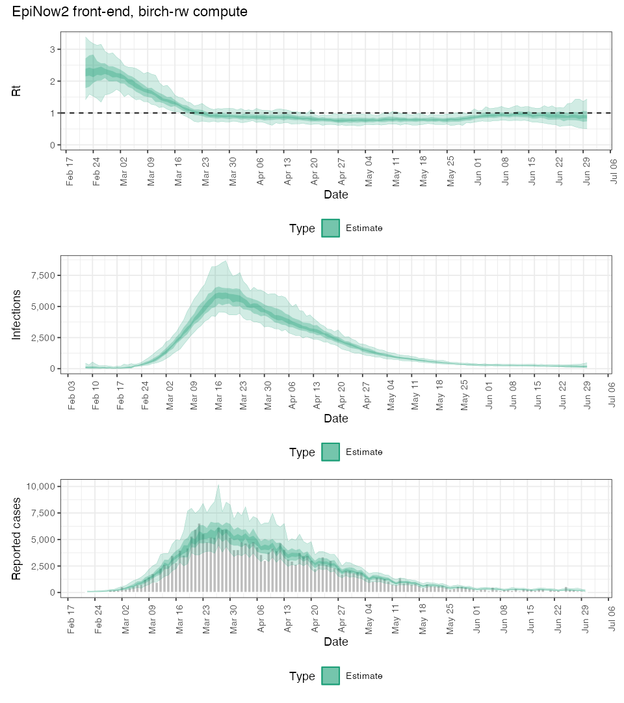

# RenewalBirch

A simplified [EpiNow2](https://epiforecasts.io/EpiNow2/)-style renewal model
written in the [Birch](https://birch-lang.org) probabilistic programming
language, fit with Birch's built-in Sequential Monte Carlo. The point is to
exercise Birch's SMC machinery — the alive particle filter, delayed sampling, and
Murray's lazy object-copy substrate — on a realistic epi model, with an
`epinow_birch()` front-end that drops Birch-SMC into the compute slot EpiNow2
normally fills with Stan/NUTS. It includes a working, hand-written **SMC²**
(nested particle filters with PMMH rejuvenation) for proper static-parameter
inference.

Fit to EpiNow2's packaged `example_confirmed` COVID case series (130 days).

## EpiNow2 front-end: `epinow_birch()`

Birch-SMC drops into the compute slot that Stan/NUTS fills in EpiNow2, reusing
EpiNow2's *own* machinery on both ends — `discretise()`/`get_pmf()` to turn the
distribution specs into the model's PMFs, and `calc_summary_measures()` +
`plot_estimates()` to render the results. So an epi user gets the familiar
EpiNow2 Rt / infections / reported-cases plots, with a particle filter doing the
inference instead of Stan.

```r
source("R/epinow_birch.R")
fit <- epinow_birch(
  EpiNow2::example_confirmed,                          # data (positional)
  generation_time = EpiNow2::example_generation_time,  # dist specs, as in epinow()
  delays          = EpiNow2::example_incubation_period +
                    EpiNow2::example_reporting_delay,
  method          = "rw"    # "rw" = self-organizing-RW + alive PF; "smc2" = nested SMC²
)
plot(fit)                   # EpiNow2-style Rt / infections / reported-cases panel
```

Or just run the demo (after `birch build`) — one call, ~1 minute:

```sh
Rscript demo.R            # -> figures/epinow_birch_demo.png
```



The signature mirrors the core of `epinow()` — `data` positional; `generation_time`,
`delays`, `obs` kwargs — plus a Birch `method` (`"rw"`, with `nparticles`/`nsamples`/
`rw_sd`; or `"smc2"`, with `ntheta`/`nx`). Other `epinow()` options are out of
scope for this toy. `method = "smc2"` currently returns the static-parameter
posterior (θ); routing its state trajectories into the same plots is the
`(θ_i, x_T,i)` extraction noted under Possible directions.


## The model

Continuous renewal; stochasticity enters at observation (EpiNow2's default).

| Component | Specification |
|---|---|
| **Seeding** | Each initial latent infection over the generation-interval window (`uot = 14` days) is its own sampled parameter, `logI0[j] ~ Normal(log(mean first-week cases), 1)` — replaces EpiNow2's exponential-growth root-find. |
| **Generation interval** | EpiNow2's default Gamma (mean 3.64 d, sd 3.08 d, max 14; Ganyani et al.), discretised via EpiNow2's own `discretise()`. |
| **Reporting delay** | EpiNow2's default incubation LogNormal (meanlog 1.62, sdlog 0.42) convolved with the reporting LogNormal (meanlog 0.58, sdlog 0.47), discretised and truncated. |
| **Rt** | First-difference random walk on `log Rt`: `logR[1] ~ Normal(-0.347, 0.833²)` (= EpiNow2 `LogNormal(mean 1, sd 1)` on R₀), then `logR[t] ~ Normal(logR[t-1], σ_rw²)`, `σ_rw ~ HalfNormal(0, 0.1)`. (EpiNow2 default is a GP; we simplify to a RW.) |
| **Renewal** | `I_t = R_t · Σ_{s=1..14} g_s · I_{t-s}` (no susceptible depletion — EpiNow2 default). |
| **Day of week** | Length-7 simplex (softmax of 7 logits) × 7 so it averages to 1 — EpiNow2's `week_effect`. |
| **Observation** | Delay-convolved, day-of-week-adjusted expected cases; Negative-Binomial-2 likelihood, `Var = μ + μ²/φ`, `1/√φ ~ HalfNormal(0, 0.25)`. Implemented with a `factor` matching Stan's `neg_binomial_2`. |

### The static-parameter problem, and two engines

Birch 2.1.7 ships only `ParticleFilter` / `AliveParticleFilter` and a single
`ParticleSampler` (no PMMH, no working move kernel — see Notes below).
Importance-sampling the static parameters (`σ_rw`, `φ`, day-of-week) from the
prior is degenerate on a long series, so the example carries two engines:

**1. `RenewalModel` — self-organizing RW (fast; the default).**
The static nuisances are promoted to *slowly-drifting states* via a small
fixed-variance random walk on their unconstrained domains (Kitagawa 1998;
Liu-West 2001 without shrinkage), so the alive particle filter rejuvenates them
at every resample: `ls_rw = log σ_rw`, `lphi = log φ`, and 7 day-of-week logits
each drift with a fixed jitter `τ ≈ 0.03`. Each particle carries its own tiny
evolving static-state, copied on write by Birch's lazy object-copy. Infections
stay deterministic and are advanced incrementally (`simulate(t)` computes only
`I[t]` as one `O(uot)` convolution — never re-solving from `t=1`).

**2. `smc2` — SMC² (proper static-parameter inference).**
`src/smc2.birch` is a custom Birch program implementing SMC² (Chopin, Jacob &
Papaspiliopoulos 2013): an outer SMC over θ = (log σ_rw, log φ, 7 day-of-week
logits), each θ-particle owning an inner bootstrap filter (`RenewalModelFixed`)
over the states. At each observation every inner filter steps once, the
θ-particle is reweighted by the inner filter's incremental `lnormalize`, and when
the θ-ESS falls below `ess_frac·ntheta` the θ-particles are resampled
(lazy-copying their inner filters) and **PMMH-rejuvenated** — propose θ′ from an
adaptive random walk scaled by the empirical variance of the θ-population
(2.38²/d, Roberts–Rosenthal) plus a nugget, run a fresh inner filter over the data
so far, accept on the marginal-likelihood + prior ratio. By default the proposal
uses only the per-component variances (`full_cov = false`); dropping the noisy
off-diagonal correlations stabilises the move at modest particle counts, while
`full_cov = true` uses the full Cholesky. Mixing hinges on `nx` (inner particles):
the inner log-likelihood variance grows with `t`, so too-small `nx` gives noisy ML
estimates → low PMMH acceptance → particle collapse; `nx` should scale with the
series length (see growing-`Nx` under Possible directions). It uses only the
working bootstrap filter and
its `lnormalize` — no autodiff, no move kernel. The recovered θ posterior
**agrees with the RW engine** (σ_rw ≈ 0.08, φ ≈ 7, day-of-week ≈ 1), giving proper
joint uncertainty on the statics. See `figures/smc2_posterior.png`.

### Reading the output (important)

Each `ParticleSampler` run's `draw()` already samples one ancestral trajectory
in proportion to the particle weights, so the `nsamples` runs are
**equally-weighted posterior draws** — the credible bands come from their spread.
The per-run `lweight` is the marginal-likelihood estimate (for evidence / an
outer PMMH), **not** a cross-run importance weight; do not reweight the
trajectories by it. `R/plot_results.R` pools them with equal weight.

### Notes on Birch capabilities (from this exercise)

- **Restart from output?** No built-in resume/checkpoint (`birch sample` has no
  such flag; the library's `Checkpoint` is delayed-expression autodiff
  memoisation). You *can* warm-start manually: `read(buffer)`/`read(t)` fill any
  model variable, so a saved state window from a prior output can be injected as
  the initial condition (an anchor-init hook — not yet added here).
- **Move kernel / fixed-lag.** The `Kernel` base carries `nlags` (fixed-lag
  window), `nmoves`, and a PID-tuned `scale`; `LangevinKernel` does a gradient
  (MALA) move. But this move machinery is **not functional for a particle filter
  in 2.1.7** (segfaults / hangs, and is untested in the repo test suite, whereas
  AD itself is tested) — which is why static-parameter inference here goes via
  SMC² rather than an in-filter move. See Possible directions for the MALA route
  that *would* work (Fisher's identity, outer θ-move).
- **Parallelism — works on Linux, not on the macOS Homebrew build.** `smc2.birch`
  uses `parallel for` over the θ-particles (the loop is embarrassingly parallel),
  and it *does* transpile to real `#pragma omp parallel for`. It is correct
  (posterior unchanged, no races) but runs **single-threaded on the Homebrew
  macOS 2.1.7 binary** (`user ≈ real` on 10 cores): Apple clang doesn't enable
  OpenMP by default, so the pragmas are compiled out (`-Wno-unknown-pragmas`, no
  `-fopenmp`), and the shipped `numbirch`/`membirch`/`birch-standard` `.dylib`s
  were themselves built single-threaded — forcing `-fopenmp` on just the package
  segfaults against those non-thread-safe libraries. `membirch`'s header *is*
  written for OpenMP (`#ifdef _OPENMP … omp_get_thread_num()`), so the substrate
  is designed to be thread-safe; it simply has to be **compiled** that way. On
  **Linux with GCC** (native `-fopenmp`, thread-safe throughout), a from-source
  build of the whole Birch stack threads correctly and the `parallel for` gives a
  near-linear speedup — that's the recommended route for real workloads. The
  macOS/Apple-clang/libomp friction is exactly why the Homebrew bottle is serial;
  it's fine to leave macOS single-threaded. (NumBirch also has a CUDA/GPU backend,
  NVIDIA-only, again a from-source build.)
- **For readers from Gen.jl:** Birch has no static-DSL argdiff incremental
  `update`; it offers checkpointed stepwise SMC, lazy object-copy (copy-on-write
  particle state), and delayed sampling / Rao-Blackwellisation instead.

## Results

- **RW engine** (`nparticles = 512`, `nsamples = 200`, 144 steps): ~268 s
  single-threaded on an M-series Mac. Smooth posterior Rt (≈2 in early March,
  crossing 1 in late March, ≈0.85 through spring, rising in June) with 50 %/90 %
  bands, `σ_rw ≈ 0.09`, `φ ≈ 7`.
- **SMC²** (`ntheta = 100`, `nx = 100`): ~5 min; sharp unimodal θ posterior
  centred on the RW-engine values (`σ_rw ≈ 0.08`, `φ ≈ 7`), tighter than the RW
  engine's. (At `nx = 40` the posterior collapses — the growing-`Nx` issue.)

See `figures/`.

## Possible directions (not implemented)

- **Offline→online handoff: SMC² warm-start for a cheap RW filter.** Run the slow SMC²
  to burn in the hyperparameters, then hand off to the fast self-organizing-RW
  bootstrap filter for online continuation — seeded from the *proper* joint
  posterior instead of the prior. At time `T`, SMC² already holds a weighted set
  `{θ_i}` each with an inner filter approximating `p(x_{1:T} | y, θ_i)`; draw
  `(θ_i, x_T,i)` by sampling one inner particle per θ-particle (∝ inner weights)
  and reading its `logR_T` + recent infection window, then seed a new RW-θ filter
  with those `N` distinct particles and carry on for `t > T`. This is exactly the
  **anchor-init hook** (initialise from a supplied state window, not the `t=1`
  seeds). The one Birch unknown is whether a filter's particle array (`filter.x`)
  can be populated from outside — if not, wrap a custom filter loop as
  `smc2.birch` already does. Hand off right after a PMMH move, when θ diversity is
  freshest. Static→drifting θ is a deliberate approximation, now well-initialised.

- **Growing `Nx` for SMC².** The current driver fixes the inner particle count,
  which is why the late-`t` PMMH replays get both slow and less effective (the
  log-likelihood-estimator variance grows ~linearly in `t`). The classic fix is to
  grow `Nx` over the sweep — monitor the move acceptance rate and double `Nx` via
  the importance-sampling *exchange* step (Chopin–Jacob–Papaspiliopoulos 2013),
  keeping the estimator variance ≈ 1. `Nx` also need not be uniform across
  θ-particles.

- **MALA for the outer θ-move.** A gradient θ-move needs the marginal-likelihood
  score `∇_θ log p(y|θ)`, which a particle filter doesn't give differentiably
  (resampling is non-differentiable — the same wall the in-filter move kernel
  hits). The legitimate route is Fisher's identity: average each inner particle's
  `∇_θ` of its *complete-data* log-density — exactly what Birch's *working*
  per-model AD (`test_grad`) computes — but it needs per-particle score
  accumulation + resampling-ancestry bookkeeping, and pays off only if θ becomes
  high-dimensional (here it is 9-D and RW-MH mixes fine).

## Installation

**1. Install the Birch toolchain.** ([full instructions](https://birch-lang.org/getting-started/))

```sh
# macOS (Homebrew):
brew install lawmurray/all/birch          # pulls in numbirch, membirch, birch-standard

# Linux: install from the software repository, or build from source
#   (see birch-lang.org/getting-started). A from-source build is also what enables
#   OpenMP threading for `parallel for` — see Notes on Birch capabilities.
```

**2. Install the R dependencies.**

```r
install.packages(c("EpiNow2", "jsonlite", "ggplot2", "patchwork", "data.table"))
```

**3. Build the model.** From this `RenewalBirch/` directory:

```sh
birch build          # transpile the .birch sources to C++ and compile the package
```

`birch build` compiles the package in place, which is all the demo and the `birch
sample` / `birch smc2` programs need. (`birch install` would additionally install
it system-wide as a library other Birch packages can `require` — not needed here.)

## Running it

The one-call front-end (after `birch build`, a single R call):

```sh
Rscript demo.R                                 # epinow_birch() end-to-end -> figures/
```

Or the underlying steps directly (run configs are generated, not committed —
`epinow_birch()`/`demo.R` write theirs automatically; here we write one inline):

```sh
Rscript R/prepare_data.R                          # EpiNow2 example data + PMFs -> input/

cat > config/renewal.json <<'JSON'
{ "model":  {"class": "RenewalModel"},
  "filter": {"class": "AliveParticleFilter", "nparticles": 512},
  "sampler":{"nsamples": 200},
  "input":  "input/epinow2_example.json",
  "output": "output/renewal.json" }
JSON
birch sample --config config/renewal.json         # RW fit -> output/renewal.json
Rscript R/plot_results.R output/renewal.json rw   # -> figures/{rt,infections,pp}_rw.png

# SMC² — proper static-parameter posterior (custom program, no config):
birch smc2 --ntheta 100 --nx 100 --output output/smc2.json    # nx scales with series length
Rscript R/plot_smc2.R output/smc2.json output/renewal.json   # -> figures/smc2_posterior.png

# optional: EpiNow2 (Stan) reference Rt to overlay (slow, minutes):
Rscript R/epinow2_reference.R                     # -> output/reference_rt.csv
```

## Layout

```
RenewalBirch/
├── birch.yml                      # package manifest
├── demo.R                         # one-call epinow_birch() demo (start here)
├── src/
│   ├── RenewalModel.birch         # engine 1: self-organizing RW
│   ├── RenewalModelFixed.birch    # fixed-θ inner model for SMC²
│   └── smc2.birch                 # engine 2: SMC² driver program
├── config/                        # run configs written here (generated, not committed)
├── input/                         # generated by prepare_data.R / epinow_birch()
├── output/                        # written by `birch sample` / `birch smc2`
├── R/
│   ├── epinow_birch.R             # EpiNow2-style front-end (specs in, EpiNow2 plots out)
│   ├── prepare_data.R             # build the Birch input from EpiNow2 defaults
│   ├── plot_results.R             # RW trajectories -> Rt / infections / reported-cases
│   ├── plot_smc2.R                # SMC² θ posterior
│   └── epinow2_reference.R        # optional EpiNow2/Stan reference Rt
└── figures/                       # plots
```
