# Opening

## Context

- I've had a long term interest in SMC methods, and I think they have a lot to offer for
  epidemiological inference.
- Goal of this talk: tell you what **SMC is good at**, and give you a taste of how it works in practice on the renewal model.
- This is largely self-motivated by my interests.
- Tl;dr: SMC works well for time-evolving latent states and discrete latents.

## Two ways to generate samples from a posterior

::: {.columns}

::: {.column width="50%"}
**MCMC**

- A chain of dependent samples.
- The target is a **fixed** distribution: the posterior $\pi_T$.
- Each step is an *attempt* at the same target.
:::

::: {.column width="50%"}
**SMC**

- A **sequence of targets** $\pi_0, \pi_1, \pi_2, \dots, \pi_T$.
- Each target is a *different* distribution.
   - Filtering: $\pi_t = \pi(x_t \mid y_{1:t})$ at time $t$.
   - Tempered SMC sampler: $\pi_t \propto \pi(\theta \mid y)^{\beta_t}$.
- Either a *cloud* of weighted particles or a probability density evolving through the sequence.
:::

:::

## The probability density point of view

**SMC is sequentially evolving a probability distribution.**

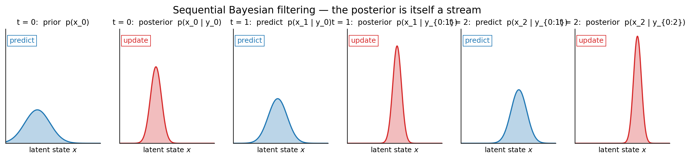{width=95%}

- Start with a prior.  Predict forward under the dynamics.  Update with
  the next observation.  Predict.  Update.  Repeat.
- The posterior at time $t$ is the input to the predict step for
  time $t+1$.  Recursive Bayes.

# Is anyone actually using this?

## SMC in numerical weather prediction

- Honest framing: every Tier-1 weather centre runs **hybrid
  4D-Var + EnKF**.  Pure particle filters are dimensionality-limited
  in NWP (state $\sim 10^7$--$10^9$).
- Operational: ECMWF hybrid 4D-Var + EDA [@bonavita2015hybrid];
  NCEP GFS 4D Hybrid EnVar with an 80-member EnKF since 2016
  [@kleist2015gfs]; Met Office [@clayton2013ukmo]; DWD KENDA
  [@schraff2016kenda]; JMA — all hybrid 4D-Var + EnKF.
- Localised PFs *inside* operational frameworks: Poterjoy's local PF
  tested in the NCEP regional system and the NOAA FV3 framework
  [@poterjoy2017lpf; @poterjoy2019lpf].
- The honest "why hybrid, not pure PF" reference: @vanleeuwen2019pfreview.

## SMC in epidemiology — actually in production

- **UKHSA / PHE COVID-19 first-wave nowcast** [@birrell2021covid] —
  bootstrap PF for the state, adaptive MCMC for the static
  parameters.  Fed SPI-M-O / SAGE through the first wave.
- **LSHTM real-time forecasting** for Ebola and seasonal flu
  [@funk2018realtime; @funk2019ebola] — particle MCMC; the WHO Ebola
  Forecasting Challenge contribution.
- **The PMCMC tutorial the UK respiratory-virus community actually
  uses** [@endo2019pmcmc] — van Leeuwen and Baguelin both at UKHSA's
  modelling group.
- **Storvik-flavour epi**: Dukic, Lopes & Polson [@dukic2012flu] —
  Particle Learning + state-space SEIR on Google Flu Trends.
- **Counterpoint**: Columbia's FluSight component uses an EAKF, not a
  PF, and beats PF in their setting [@yang2014filterflu].  The honest
  comparison paper — good balance.

## And outside epi

- **Original bootstrap PF, defence radar / sonar**
  [@gordon1993novel].  DRA Malvern (UK); operational tracking
  deployments documented in Ristic--Arulampalam--Gordon 2004.
- **Robotics SLAM** — FastSLAM ran on Stanford's autonomous vehicles
  [@montemerlo2003fastslam2].
- **Quant finance** — auxiliary PF for stochastic volatility
  [@pitt1999auxiliary]; widely deployed sell-side.
- **Take-away for pyrenew**: the dimensionality concerns that keep
  pure PFs out of NWP do not bite at pyrenew scale (tens of state
  variables, not $10^9$).  The places PF wins — sequential updates,
  discrete latents, custom proposals — are precisely the regimes
  pyrenew encounters.

# A family of filters

## A whirlwind of SMC methods

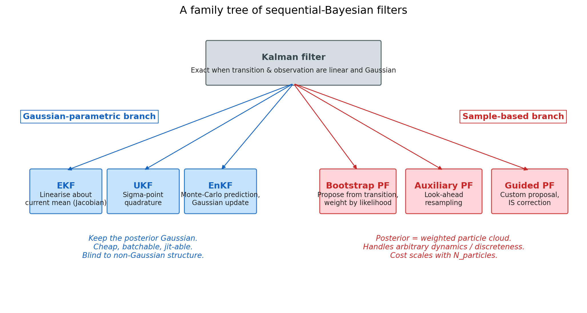{width=100%}

- **Kalman**: exact when transition + observation are linear and Gaussian.
- **EKF / UKF**: Gaussian approximations of the posterior; cheap, batchable.
- **EnKF**: Monte-Carlo prediction step with Gaussian update — high-D.
- **Particle filter**: weighted-particle representation; no Gaussian assumption.

## Which axis are we sequential in?

Today's focus: **data-sequential filters**.

- One observation at a time, in time order.
- Recursive update of the posterior over the latent state.
- Operationally a fit: you ingest data as it arrives.

Contrast (mention only): **SMC samplers over a tempered static posterior** —
the "sequential" axis is $\beta$, not $t$. Useful for hard static-only
posteriors. Same machinery, different target sequence.

## The bootstrap PF in one slide

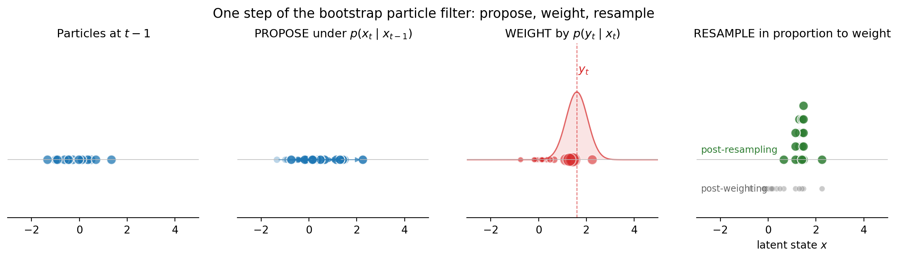{width=100%}

1. **Propose** from the transition $p(x_t \mid x_{t-1})$.
2. **Weight** by the likelihood $p(y_t \mid x_t)$.
3. **Resample** in proportion to weight.

That's it. The particle cloud is your posterior approximation,
non-parametrically, at every $t$.

# The natural strength of SMC: time-evolving state

## A renewal model is a hidden Markov chain

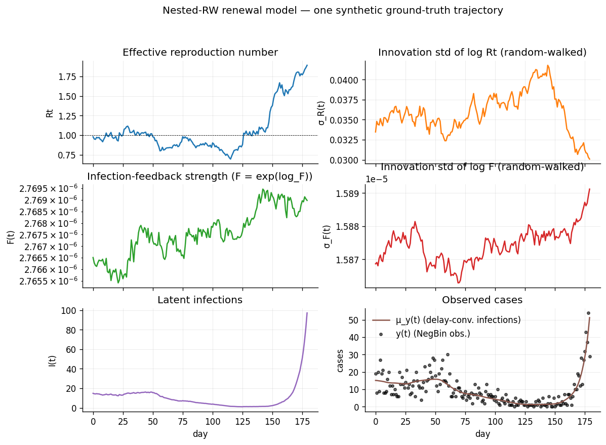{width=90%}

- $\log R_t$, $\log\sigma_R$, $\log F$, $\log\sigma_F$ all evolve as
  nested random walks. By construction they are *time-indexed* hidden
  states with Markov dynamics.
- This is exactly what a particle filter is designed to do.

## The PF gives you the *path* posterior

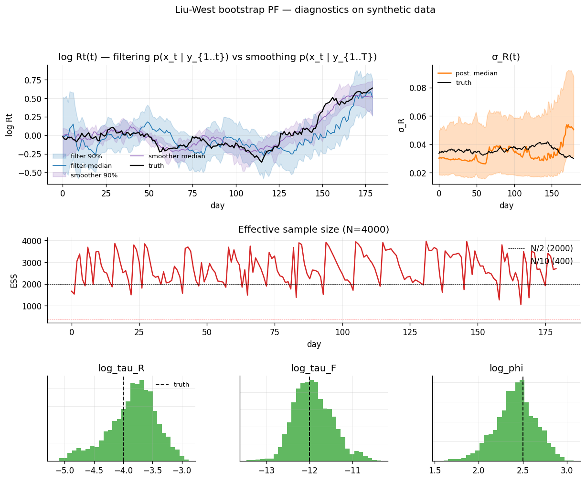{width=80%}

- Filtering band: $p(x_t \mid y_{1:t})$ at each $t$.
- Smoothing band: $p(x_t \mid y_{1:T})$ via backward pass / FFBS.
- Joint posterior over $(x_1, \dots, x_T)$ — not just marginal at $T$.
- Parameter posteriors as a side-effect (right strip).

## Sequential updates without refit

- New week of data arrives.
- **NUTS**: re-run the whole sampler. O(weeks of compute).
- **SMC**: ingest the new observations into the *existing* cloud
  (`extend_liu_west`, `rolling_origin_forecast` in this repo).
  O(weeks of *new* data).
- This is the operational story your team probably cares about most.

## Data fault detection — for free

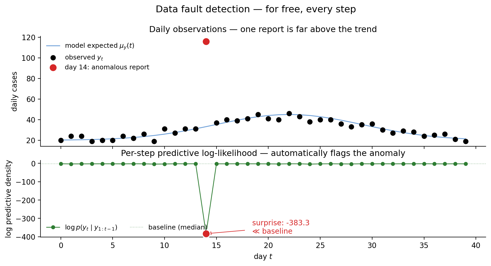{width=85%}

- At every step the PF computes
  $\log p(y_t \mid y_{1:t-1}) = \log \mathbb{E}_{x_t \mid y_{1:t-1}}\!\big[p(y_t \mid x_t)\big]$
  as a by-product of the weight update.
- This is a **natural surprise score** for each new observation —
  *under the current model and history, how unexpected was today's data?*
- Anomalous reports (duplicate batches, decimal-shift typos, holiday
  effects) light up the score immediately.
- A NUTS refit gives you the *posterior over θ given all data*; it does
  not, by itself, give you "the predictive density of next week's first
  Tuesday". SMC gives that to you for free, observation by observation.
- Pairs naturally with monitoring ESS — sudden drops also flag
  model/data mismatch.

# The trade-off: static parameters

## The hard problem — $\theta$

- Particle filters are great at *state evolution*.
- Particle filters are bad at *static parameter inference*.
- Reason: if $\theta_i$ never changes, resampling shrinks the
  $\theta$-cloud — eventually all surviving particles share the same $\theta$.
- Need to add diversity *somehow*.

## Two principled answers

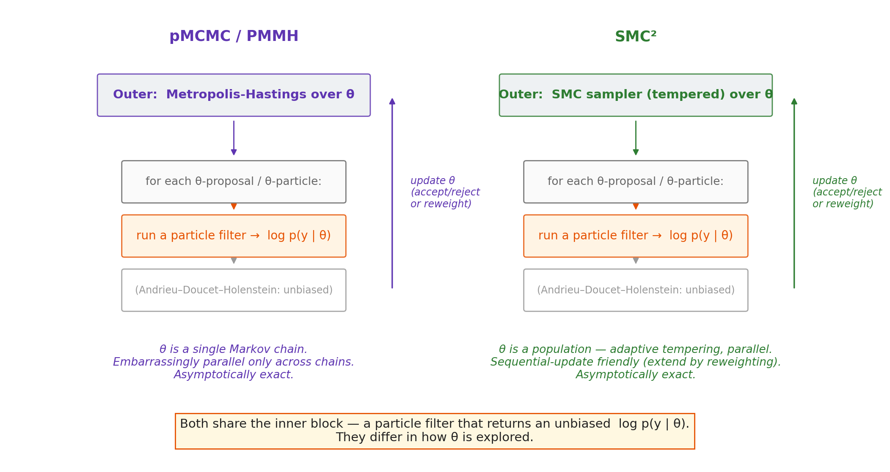{width=95%}

- **pMCMC / PMMH** (Andrieu, Doucet & Holenstein 2010) — outer Metropolis
  on $\theta$; inner PF gives unbiased $\log p(y\mid\theta)$.
- **SMC²** (Chopin, Jacob & Papaspiliopoulos 2013) — outer **SMC** on
  $\theta$ (tempered); inner PF as above.
- Both are asymptotically exact. They differ in how the outer loop
  explores $\theta$.

# SMC² in detail

## SMC² structure

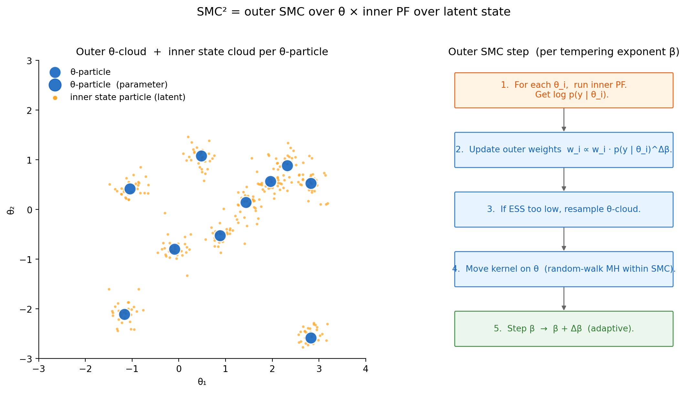{width=100%}

## Cost of full SMC²

- $O(N_\theta \cdot N_x \cdot T)$ per outer SMC step.
- For our renewal model: $N_\theta \approx 128$, $N_x \approx 2000$,
  $T \approx 180$ — borderline OK; for a talk or for large batches of fits it's painful.
- So in this project I offer **two cheap approximations**, each
  relaxing the gold standard along a different axis.

# Approximation 1 — SMC² with a Gaussian-filter inner

## Idea

- Keep the outer SMC on $\theta$.
- Replace the *inner particle filter* with a **UKF** or **EKF**.
- Cheaper inner (no particles); inner gives an *approximate*
  $\log p(y \mid \theta)$.
- Using this approach in the mechanistic model experiment.

## Result

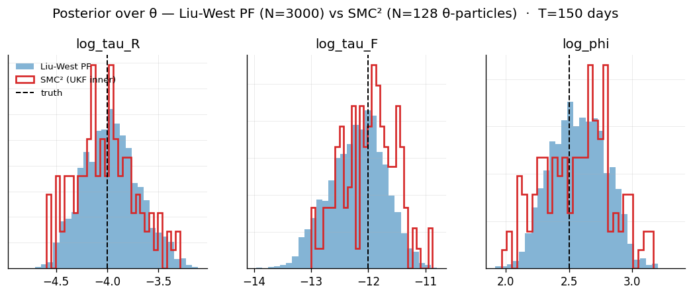{width=90%}

- Agreement with Liu-West-PF on $\log\varphi$ (the NegBin overdispersion).
- **Disagreement on $\log\tau_R, \log\tau_F$** — the nested-volatility
  parameters.

## When this is fine, and when it isn't

- **Fine**: $\theta$ only affects directly-observable noise (like $\log\varphi$).
- **Not fine**: $\theta$ controls the *variance of an unobserved latent*.
- Why: the chain
  $\tau_R \to \log\sigma_R$ innovation variance $\to \sigma_R$ via exp $\to$
  $\log R_t$ innovation variance,
  decouples at the Gaussian-filter linearisation point. The inner block
  is structurally blind to $\tau$.

# Approximation 2 — Liu-West jitter PF

## Idea

- Eliminate the *outer* SMC.
- Treat $\theta$ as a slowly-evolving "state" — drift the parameter
  cloud each step with shrink-jitter.
- One cloud, one sweep through the data. Much cheaper.

## The mechanic

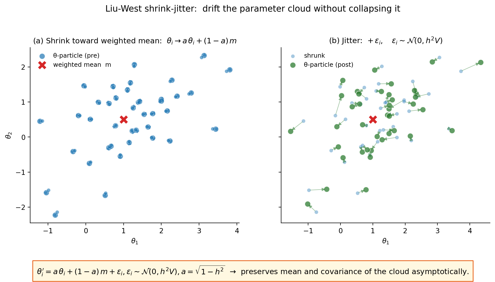{width=100%}

::: notes
Liu & West (2001). The shrinkage $\sqrt{1-h^2}$ exactly cancels the
variance inflation of the Gaussian jitter, so the cloud's mean and
covariance are preserved asymptotically. $h \in [0.05, 0.2]$ controls
the per-step jitter scale.
:::

## Cost & caveat

- Cost: single cloud, no nested PF. Cheap.
- Recovers parameters the Gaussian inner missed: $\log\tau_R, \log\tau_F$.
- **Caveat**: the Liu-West "artificial dynamics" on $\theta$ is itself
  an approximation. The $\theta$-posterior has *finite memory* — old
  data is gradually forgotten as the cloud jitters.

# Fully discrete latents

## The problem with discrete latents and differentiable samplers

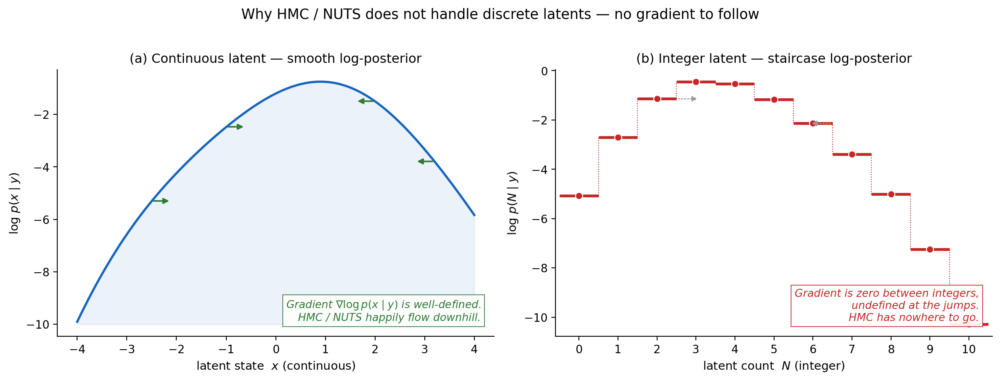{width=100%}

- Integer-latent log-posterior is piecewise constant.
- HMC gradient is zero almost everywhere, undefined at the jumps.
- Marginalising the integer out doesn't always work — cohort accounting,
  contact tracing.

## Observation as dynamics: contact tracing + GDM

Track each cohort's *remaining-unreported* count $U_s$ as it ages.
For each stage $s = 1, \dots, L-1$:

$$q_s \sim \text{Beta}(\alpha_s,\,\beta_s), \qquad O_s \sim \text{Binomial}(U_s,\, q_s)$$

- $q_s$ is the *fraction of the remaining cohort reported at age $s$*.
  Drawn fresh per stage — that's the **stick-breaking** structure.
- Marginally $O_s \sim \text{BetaBin}(U_s, \alpha_s, \beta_s)$ — the "GDM".
- We parameterise the per-stage Beta mean on the probit scale and share
  a concentration:
  $$\Phi^{-1}(p_s) = b_0 + b_1 (s - 1), \quad \alpha_s = p_s M, \quad \beta_s = (1 - p_s) M$$
- Three inferred parameters: $(b_0, b_1, \log M)$.

Daily observed count is the partition sum:
$y_t = \sum_s O_s.$

## Example 12 — contact tracing + GDM observation

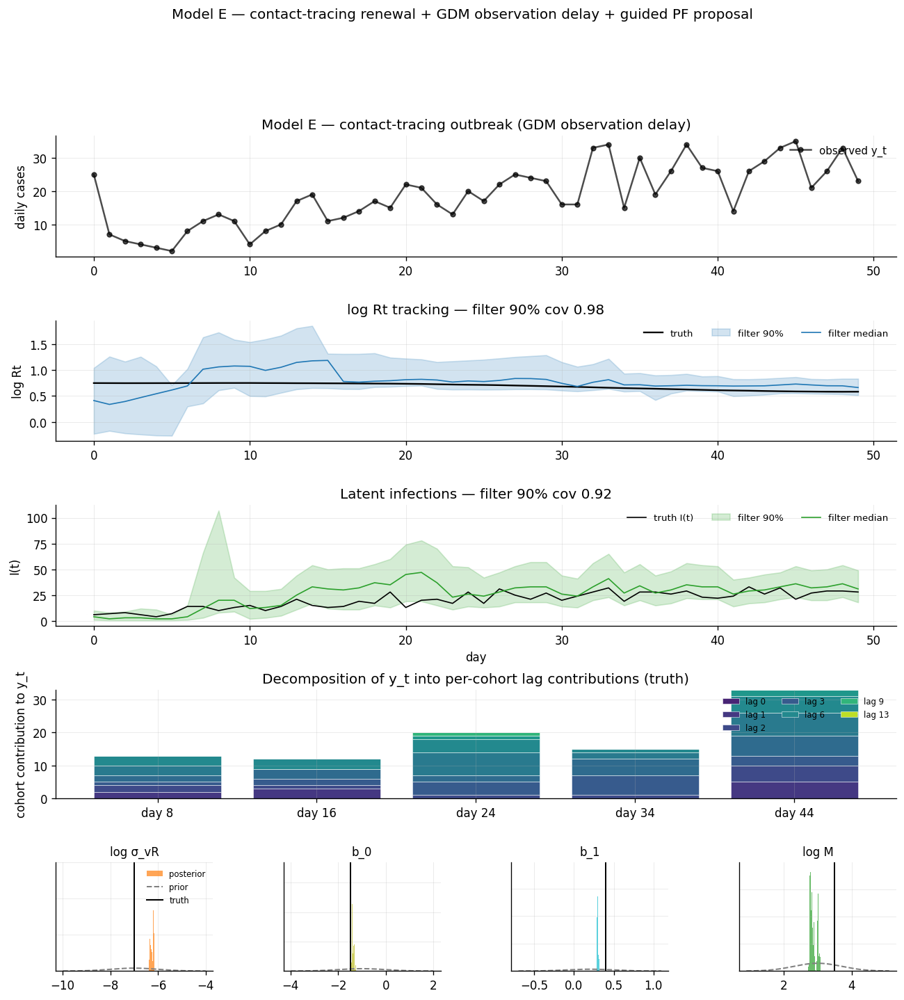{width=80%}

- Poisson new infections $N_t$.
- 100% ascertainment.
- Cohort-partition observation via **Generalised Dirichlet Multinomial**
  (Stoner et al).
- **Reporting *is* removal** — once a case is reported, it leaves the
  renewal pool. Self-limiting outbreak.
- Truth: $\log R_t$ constant above 1. The curve bends only because
  tracing depletes the U-buffer.

## What the PF has to do

- Bootstrap PF dies: the likelihood is essentially an indicator
  ($\sum_s O_s = y_t$ exactly).
- We use a **guided proposal**: auxiliary-q Wallenius noncentral
  hypergeometric.
- Beta priors cancel; IS weight is a clean Bin/Wallenius ratio with
  a multinomial-coefficient correction.
- Full derivation in `FROM_BOOTSTRAP_TO_GUIDED.md` in the repo.

## Example 13 — structural failure when the mechanism is missing

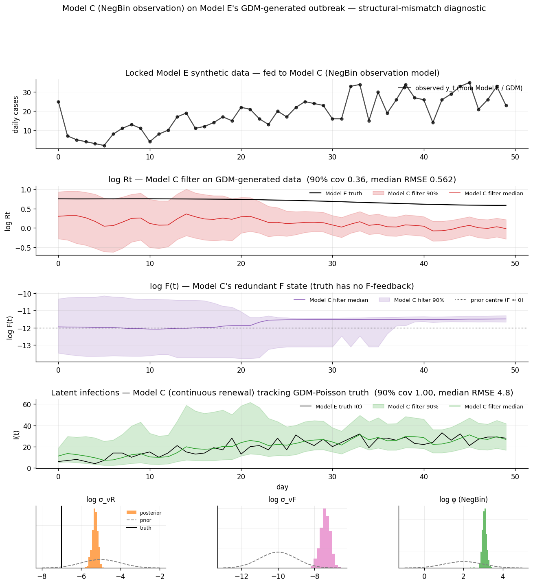{width=80%}

- Same data. Fit it with Model C (NegBin observation; no contact-tracing).
- NegBin's $\log\varphi$ absorbs the cohort-budget over-dispersion.
- $I(t)$ coverage near nominal.
- **But**: Model C infers $\log R_t$ drifting from $+0.5$ down to $-1.5$.
- Truth is $\log R_t \approx 0.75$, *constant*.
- Same fit. Opposite story about transmission.

## Example 14 — the counterfactual kill shot

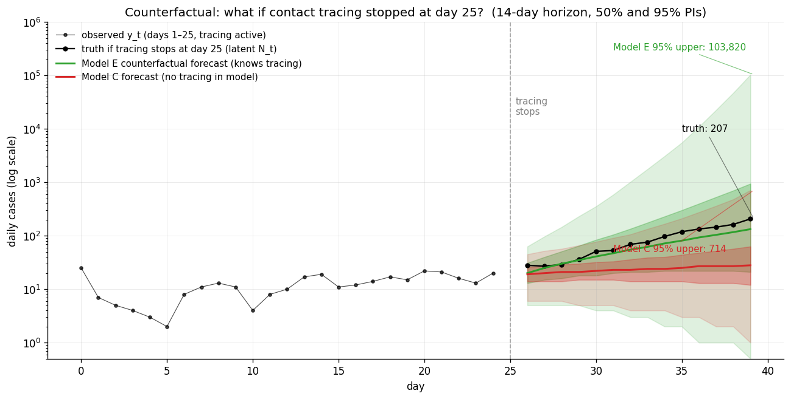{width=80%}

- Ask each model: *what if tracing stops on day 25?*
- Truth (no tracing from day 25): 28 → **207** cases/day in 14 days.
- Model E forecast 95% upper: **103,820**.
- Model C forecast 95% upper: **714**.
- **146× gap in worst-case forecasts**.

# Frontiers not taken

## Directions worth your attention

- **Temfack & Wyse — state-space epidemiological modelling**
  [@temfack2024esmc2].  Recent work on SMC for compartmental epi
  models with realistic observation processes — proposes eSMC²
  (EnKF inner block) for tractability.

- **Storvik — sufficient statistics for parameter learning**
  [@storvik2002; @fearnhead2002; @polson2008practical; @carvalho2010pl].
  When the parameter posterior given the state has a tractable form,
  *track the sufficient statistics through the particles* instead of
  jittering.  Sidesteps Liu-West's "artificial dynamics" approximation.
  Conjugacy-limited but **exact** where it applies.

## And a few more, briefly

- **FFBS smoothing** — fixes genealogy-tracing path degeneracy at long $T$.
  ~100 LOC on top of `pfjax`'s filter output.
- **Full SMC²+PF** — gold standard; we ship two cheap approximations
  instead, but the gold standard is a tractable next step.
- **Augmented-state UKF** — include noise variables in the state and
  propagate via sigma-points; recovers some of the $\tau$
  identifiability the Gaussian inner currently loses.

# Closing

## When to reach for SMC

- **Sequential updates** without full refits — operational deployment.
- **Fully discrete latents** — integer cohort accounting, contact tracing.
- **Time-evolving parameters** that you want represented explicitly.
- **Custom proposals** when the likelihood concentrates sharply on a
  manifold in state space.

## And when NUTS is still the right tool

- Multi-signal joint posteriors with continuous everything.
- Complex hierarchical prior structure.
- One-off retrospective analyses with no streaming-update requirement.
- Anything where you want the canonical "exact draw from the posterior"
  story.

> Both have their place. The point of this talk is just to make sure
> SMC is on your shelf as one of those tools.

## Questions

(throughout — please interrupt)
